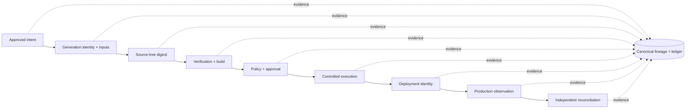
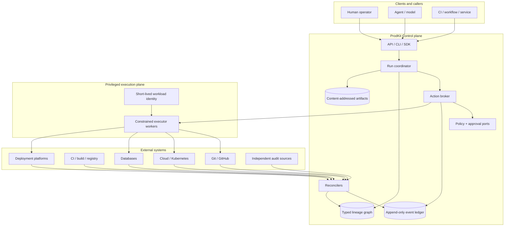
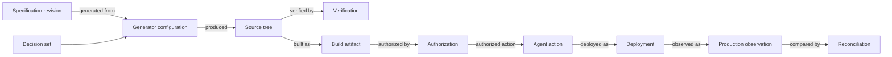

# ProdKit Control

[](https://github.com/ProdKit-dev/prodkit-control/actions/workflows/ci.yml)
[](https://github.com/ProdKit-dev/prodkit-control/actions/workflows/security.yml)
[](https://github.com/ProdKit-dev/prodkit-control/actions/workflows/codeql.yml)
[](LICENSE)
[](pyproject.toml)

A provider-neutral, language-neutral **intent-to-production control and assurance plane** for software changes and AI/agent actions.

> **ProdKit Control connects approved intent to verified production state through a typed, content-addressed, independently reconcilable lineage—without requiring ProdKit to own specification authoring, generation, Git, CI, deployment, databases, observability, or a model provider.**

Models and agents are treated as **untrusted proposers**. A tool call is not authority. Production effects must pass authenticated identity, policy/approval, exact-action binding, constrained execution, durable evidence, and independent observation appropriate to the selected deployment profile.

Current release: **v0.9.1** — public-readiness patch for cumulative completeness and language-neutral authority.  
Next milestone: **v0.10.0** — Production Candidate.

v0.9.1 does **not** claim the v1.0 enterprise production-assurance gate. Maturity claims remain tied to documented evidence, not package count or a green build alone.

## Start here

### Requirements

For the Python control plane and CLI:

- Python 3.12–3.14
- [`uv`](https://docs.astral.sh/uv/)

For TypeScript development/conformance:

- Node.js 22+
- Corepack / pnpm 10

Docker is optional for the containerized development/reference profile and container builds.

### Run the verified local demo

```bash
uv sync --all-packages --group dev --locked
uv run prodkit-control demo --output .artifacts/demo
```

The demo creates a tenant-scoped run, routes an exact action through policy and the broker, executes it through the dry-run executor, constructs a complete lineage, exports an evidence bundle, and verifies that bundle before returning success.

Run the programmatic Python example:

```bash
uv run python examples/basic_dry_run.py
```

Run the local API with the **development-only** header resolver:

```bash
PRODKIT_ALLOW_INSECURE_HEADER_AUTH=true uv run prodkit-control-api
```

Then open `http://127.0.0.1:8000/docs`. Never enable insecure header authentication in production.

See **[Getting started](docs/getting-started.md)** for distribution choices, the exact first-run path, API guidance, deployment profiles, and release verification.

## What problem it solves

An agent trace is not an audit trail, a source repository is not the complete product definition, and a tool-call log is not proof that the intended production change occurred. Code may be disposable as an implementation, but it cannot be anonymous as evidence.

ProdKit Control answers:

- What was intended?
- What exact source/artifact was produced?
- What verified it?
- What policy and approval authorized the effect?
- What exact executor acted with which bounded capability?
- What changed externally?
- What state was independently observed afterward?
- Does production agree with the claimed delivery history?



## v0.9.1 capability boundary

v0.9.1 inherits the v0.9.0 cumulative-completeness milestone and makes the repository/distribution usable as a public project. All first-party package surfaces are machine-discovered and must contain substantive implementation; optional integrations are optional dependencies, not empty placeholders.

| Capability | v0.9.1 status | Later assurance gate |
| --- | --- | --- |
| Canonical contracts, typed lineage, hash-chained evidence | Implemented | Compatibility/assurance hardening |
| Durable action execution and uncertainty handling | Implemented | Production-candidate exercises |
| Git/GitHub/CI/registry/deployment/Kubernetes/database reconciliation | Implemented first-party surfaces | Environment-specific qualification |
| Filesystem, Git, GitHub, HTTP, shell, database, Kubernetes, deployment executors | Implemented first-party surfaces | Production-candidate isolation/soak proof |
| OpenAI, Anthropic, Google, generic, Pydantic AI provider adapters | Implemented optional adapters | Provider-specific compatibility evolution |
| Agent Gateway, E2B, OPA, OpenTelemetry, Permit, Sigstore, Teleport, Temporal integrations | Implemented optional adapters | Deployment-specific qualification |
| Python and TypeScript native surfaces | Implemented | Compatibility policy evolution |
| Language-neutral authority and cross-runtime conformance | Implemented and CI-gated | Additional portable profiles |
| HA/scale, tenant-isolation engineering, governance/lifecycle, DR controls | Implemented milestone foundations | Production Candidate + independent assurance |
| Public install/use/docs/support/security surface | v0.9.1 release gate | Ongoing maintenance |
| Production Candidate | Not claimed | v0.10.0 |
| Enterprise production assurance | Not claimed | v1.0.0 |

Before enabling production actions, read [Guarantees and non-guarantees](docs/architecture/guarantees.md), [Secure deployment](docs/security/secure-deployment.md), [Threat model](docs/security/threat-model.md), [Operations runbook](docs/operations/runbook.md), and the [Roadmap](ROADMAP.md).

## Language-neutral authority

ProdKit Control is not “Python software with TypeScript bindings” or “TypeScript software with Python bindings.” Portable semantics are defined under [`contracts/`](contracts/) as versioned specifications, canonicalization/policy profiles, and shared conformance vectors.

```text
contracts/ specifications + vectors
               |
        +------+------+
        |             |
     Python       TypeScript
     runtime       runtime
        |             |
        +--- same ----+
            semantics
```

Python and TypeScript are independent native implementations. CI fails when either runtime diverges from the language-neutral profiles.

External policy engines such as OPA or Permit, model providers, workflow engines, observability backends, sandbox providers, signing systems, and privileged-access platforms are adapters. They do not become ProdKit Control's semantic source of truth.

## System architecture



The control plane can observe and link systems it does not own. Provider-specific behavior stays behind explicit ports/adapters; privileged executors remain separate from model/agent code.

See the [Architecture overview](docs/architecture/overview.md).

## Core invariants

- **No implicit model authority.** Models/agents propose; authenticated identity, policy, approvals, and capability limits authorize.
- **Exact binding.** Authorization binds action, target, tenant, environment, policy revision, relevant evidence, and expiry.
- **Fail closed.** Missing policy/evidence, invalid approval, tenant mismatch, integrity failure, malformed adapter output, or unknown capability cannot silently become success.
- **Append, do not rewrite.** Corrections are new evidence/events; historical facts are retained.
- **Content-address important identities.** Source, artifacts, actions, observations, and evidence use deterministic identities.
- **Uncertain is not failed.** An ambiguous external side effect is reconciled before any retry that could duplicate it.
- **Independent evidence matters.** Model/provider traces and internal telemetry are witnesses, not sole truth.
- **Bypass is an assurance failure.** Production activity outside the controlled path must be detectable through external reconciliation.
- **Tenant identity is authoritative.** Production tenant/actor identity comes from authenticated context, not untrusted request fields.
- **Telemetry is not the ledger.** Sampled observability cannot replace unsampled canonical evidence.
- **Language implementations are not semantic authority.** Portable behavior is governed by versioned neutral contracts/conformance vectors.

## Canonical product lineage



`LineageGraph` is the typed semantic product lineage. `ControlEvent` is the append-only event history recording how assertions/actions entered the system. Content-addressed artifacts preserve exact retained material. External systems remain witnesses and effect owners rather than silently replacing the canonical control record.

See [Product lineage](docs/architecture/lineage.md).

## Deployment profiles

ProdKit Control deliberately separates standalone capability from assurance level.

| Profile | Purpose | Typical characteristics |
| --- | --- | --- |
| Development / reference | Local evaluation and contract testing | In-memory/reference components, explicit insecure development auth, dry-run/local executors |
| Standalone durable | Durable control deployment without another ProdKit product | PostgreSQL/artifact storage, authenticated principals, durable broker/ledger |
| Production control | Controlled production effects | Isolated executors, short-lived credentials, policy/approval integration, external reconciliation |
| Enterprise assurance | High-assurance target | HA/DR, isolation verification, retention/legal hold, SLOs, audit integrations, independent review |

The v0.9.1 release makes these surfaces public and reproducibly testable; it does not collapse the v0.10/v1.0 assurance gates.

## Repository layout

```text
contracts/                  language-neutral specifications + conformance
schemas/                    generated/public schemas
packages/
  python/
    prodkit-control-core/
    prodkit-control-runtime/
    prodkit-control-postgres/
    prodkit-control-fastapi/
    prodkit-control-cli/
    integrations/
    executors/
    providers/
    reconcilers/
  typescript/
    control/
    control-client/
    control-react/
    control-next/
docs/                       architecture, security, operations, releases
deploy/                     deployment examples/configuration
examples/                   executable public API examples
scripts/                    verification and maintenance tools
```

Package completeness is a machine-checked release contract. A first-party package may be optional at runtime, but it may not be declared supported while remaining an empty shell.

## Distribution and verification

v0.9.1 supports exact source checkout/source archives and verified GitHub Release assets. The release lifecycle builds every first-party Python wheel+sdist and every TypeScript package archive, checks package identity/version/content, adds an exact source archive and SPDX SBOM, seals checksums, publishes against the exact source SHA, and then runs independent release verification before branch cleanup.

Public PyPI/npm/container-registry publication is **not claimed** by v0.9.1. This avoids creating hidden runtime or provenance dependencies on a registry channel that the release process has not independently qualified.

See [Getting started](docs/getting-started.md), [Release/versioning contract](docs/releases/README.md), and [Verification](VERIFICATION.md).

## Development

Install the locked Python and TypeScript workspaces:

```bash
make install
```

Run the local public/release contract plus lint, typing, tests, schema checks, cross-runtime conformance, and first-run smoke checks:

```bash
make check
```

Pull requests from forks use GitHub-hosted runners. Same-repository qualification can use the configured trusted runner. Reusable workflow governance is pinned to immutable commits in the public [`ProdKit-dev/prodkit-workflows`](https://github.com/ProdKit-dev/prodkit-workflows) repository.

See [CONTRIBUTING.md](CONTRIBUTING.md).

## Security and support

Do not report suspected vulnerabilities in public issues. Follow [SECURITY.md](SECURITY.md). For usage/support boundaries, see [SUPPORT.md](SUPPORT.md).

The security model assumes agents/models are untrusted proposers, production credentials are not ambient model inputs, privileged executors are independently constrained, authoritative evidence is unsampled, and production state is reconciled after effects. Sandbox escape prevention additionally depends on the OS/container/microVM/runtime isolation used to host untrusted code; ProdKit Control does not claim a software-only guarantee that arbitrary hostile code can never escape a compromised execution substrate.

## Standards and interoperability

The architecture is designed to interoperate with:

- W3C Trace Context identifiers;
- OpenTelemetry correlation;
- JSON Schema contracts;
- SHA-256 content addressing and event chaining;
- in-toto Statement-compatible evidence;
- SLSA-compatible provenance references;
- policy-engine-neutral decisions;
- SPIFFE-compatible workload identity references.

Compatibility language is bounded by implemented adapters and release gates; it is not a blanket certification claim.

## Documentation map

- [Getting started](docs/getting-started.md)
- [Architecture index](docs/architecture/README.md)
- [Architecture overview](docs/architecture/overview.md)
- [Product lineage](docs/architecture/lineage.md)
- [Runtime/action flow](docs/architecture/runtime.md)
- [Deployment architecture](docs/architecture/deployment.md)
- [Extension architecture](docs/architecture/extensions.md)
- [Guarantees and non-guarantees](docs/architecture/guarantees.md)
- [High availability and scale](docs/architecture/high-availability.md)
- [Reliability and disaster recovery](docs/architecture/reliability-disaster-recovery.md)
- [Threat model](docs/security/threat-model.md)
- [Secure deployment](docs/security/secure-deployment.md)
- [Operations runbook](docs/operations/runbook.md)
- [Security incident response](docs/operations/security-incident-response.md)
- [Release/versioning contract](docs/releases/README.md)
- [v0.9.1 release boundary](docs/releases/v0.9.1.md)
- [Roadmap](ROADMAP.md)

## Governance and license

Contributions are welcome under [CONTRIBUTING.md](CONTRIBUTING.md) and the [Code of Conduct](CODE_OF_CONDUCT.md). Project decision and maintainer rules are in [GOVERNANCE.md](GOVERNANCE.md).

Licensed under the Apache License, Version 2.0. See [LICENSE](LICENSE) and [NOTICE](NOTICE).
