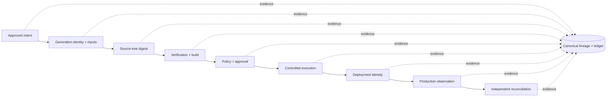
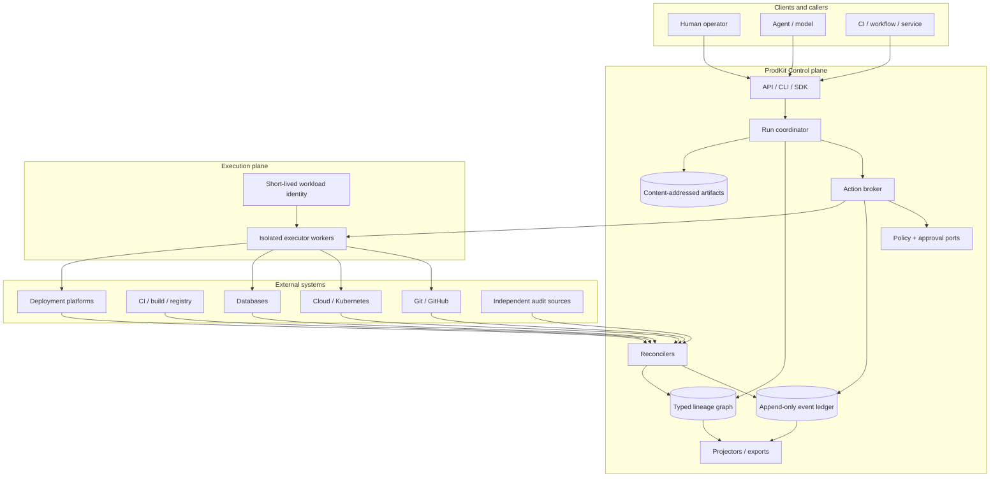
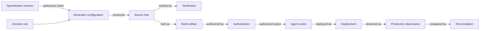
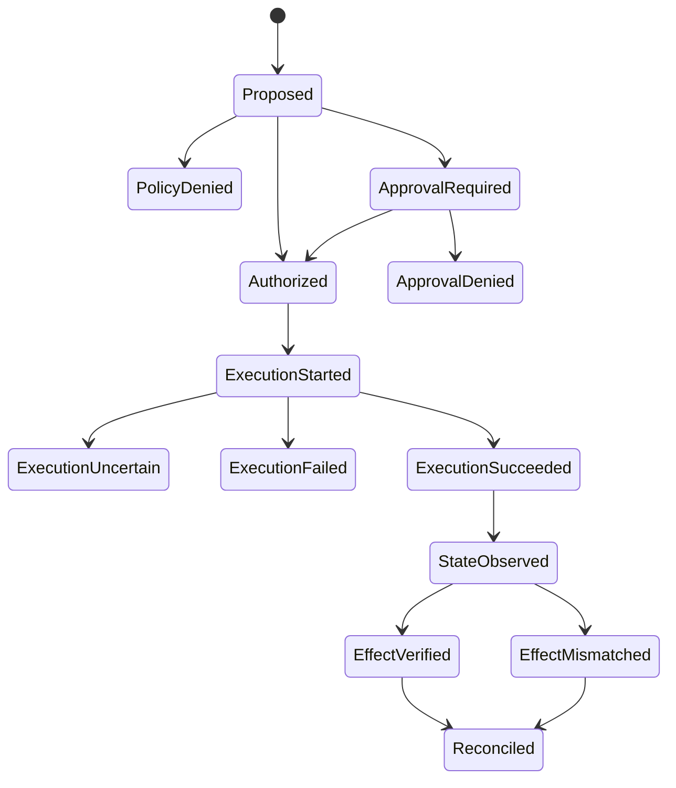

# ProdKit Control

[](https://github.com/prodkit-dev/prodkit-control/actions/workflows/ci.yml)
[](LICENSE)
[](pyproject.toml)
[](docs/architecture/observability.md)

A provider-neutral **intent-to-production control and assurance plane** for software changes.

> **ProdKit connects approved intent to verified production state through a continuous, independently verifiable lineage—without requiring ProdKit to own specification authoring, generation, CI, deployment, or observability.**

ProdKit Control is designed to be advanced, general-purpose, provider-neutral, and standalone-capable. Its enterprise production profile is deliberately gated: the repository does not treat architectural intent, extension stubs, or a green test suite as proof that every production control is already implemented.

## Project status and maturity

`v0.4.0` is the **high-availability and scale milestone**. The repository now includes the canonical foundation, hardened execution, delivery-chain reconciliation, portable assurance, and a qualified HA scheduler/control-plane layer. Enterprise assurance remains maturity-gated; later roadmap milestones cover disaster recovery, stronger tenant isolation, legal hold, compliance packs, and independent security review.

| Capability | v0.4.0 status | Next target |
| --- | --- | --- |
| Canonical contracts, typed lineage, hash-chained evidence | Implemented | Compatibility hardening |
| Durable action execution and uncertainty handling | Implemented | Broader executor qualification |
| Delivery-chain reconciliation | Implemented | Additional provider coverage |
| Portable attestations and offline verification | Implemented | Enterprise trust/retention profiles |
| HA fencing, durable bounded work, backpressure, graceful drain | Implemented and qualified | DR / regional recovery |
| Python/TypeScript canonical surfaces | Implemented | Compatibility policy expansion |
| Multi-tenant enterprise isolation | Architectural + tenant-scoped controls | Dedicated isolation verification milestone |
| DR, legal hold, compliance packs, independent security review | Roadmap | 1.0 production assurance profile |

Before enabling production actions, read [Guarantees and non-guarantees](docs/architecture/guarantees.md), [Secure deployment](docs/security/secure-deployment.md), and [the roadmap](ROADMAP.md).

## Why this repository exists

An agent trace is not an audit trail, a source repository is not the complete product definition, and a tool-call log is not proof that the intended production change occurred. Code may be disposable as an implementation, but it cannot be anonymous as evidence.

ProdKit Control preserves a typed, content-addressed chain across the systems that participate in delivery:



Models are treated as **untrusted proposers**. A model does not gain authority merely because it emitted a tool call. Every production effect must be attributable to authenticated identity, exact approved inputs, policy, executor identity, observed state, and independent evidence appropriate to the deployment profile.

## System architecture



The diagram is the control-plane architecture through `v0.4.0`: durable execution, reconciliation, portable assurance, and HA scheduling are implemented behind provider-neutral ports. Later roadmap gates focus on DR, stronger enterprise isolation, governance/compliance packs, and independent assurance.

See the [architecture overview](docs/architecture/overview.md) for the canonical layer model, trust boundaries, data ownership, invariants, and end-to-end flows.

## Core invariants

ProdKit Control is designed around these invariants:

- **No implicit model authority.** Models propose; policy, authenticated identity, and approvals authorize.
- **Exact binding.** Approval is bound to action, target, tenant, environment, policy revision, and expiry.
- **Fail closed.** Missing policy, invalid approval, integrity failure, unknown executor, tenant mismatch, or incomplete production lineage must not silently become success.
- **Append, do not rewrite.** Corrections are new events; historical evidence is preserved.
- **Content-address important identities.** Source trees, artifacts, actions, observations, and evidence are fingerprinted deterministically.
- **Uncertain is not failed.** Ambiguous external side effects require reconciliation before retry.
- **Independent evidence matters.** Provider traces and internal telemetry are witnesses, not the sole source of truth.
- **Bypass is an assurance failure.** A production action outside the controlled path must be detectable and investigated.
- **Tenant boundaries are authoritative.** Tenant identity comes from authenticated context, never from untrusted client fields alone.
- **Telemetry is not the ledger.** OpenTelemetry can be sampled; the authoritative evidence path cannot depend on sampled telemetry.

## Canonical product lineage



`LineageGraph` is the semantic product lineage. The append-only `ControlEvent` ledger records how assertions and actions entered the system, including actor, causality, evidence, and integrity chaining. Content-addressed artifacts preserve exact inputs and outputs. Evidence bundles carry portable verification material. Query tables, Git history, traces, dashboards, and provider logs remain projections or witnesses—not the canonical explanation of the system.

## Action lifecycle

Every externally visible action follows a fail-closed lifecycle. An executor exception after execution begins is **uncertain**, because an external effect may already have occurred.



The broker persists the proposal before execution. Approval is digest-bound. Idempotency claims are retained after uncertain outcomes so a blind retry cannot duplicate a possibly completed external effect.

## Deployment profiles

ProdKit Control intentionally separates **standalone capability** from **production hardening**.

| Profile | Purpose | Typical characteristics |
| --- | --- | --- |
| Development / reference | Local evaluation and contract testing | In-memory components, explicit insecure development auth, local executors |
| Standalone durable | Single-organization controlled deployment | PostgreSQL, artifact storage, authenticated principals, durable broker/ledger |
| Production control | Production actions | Isolated executors, short-lived credentials, policy/approval service, external reconciliation, signed checkpoints |
| Enterprise assurance | Regulated/high-assurance operation | HA, DR, tenant isolation verification, retention/legal hold, key rotation, SLOs, audit integrations, independent security review |

A system remains “standalone” when its core control semantics and evidence model do not require another ProdKit product. PostgreSQL, object storage, identity providers, policy engines, or orchestrators are infrastructure/adapters behind replaceable ports, not hidden ownership dependencies.

See [Deployment architecture](docs/architecture/deployment.md).

## Provider neutrality and extension model

Provider adapters normalize model interactions into canonical records; they do **not** execute tools. OpenAI, Anthropic, Google, local models, agent frameworks, MCP clients, and future providers can integrate without changing the control semantics.

The same principle applies to policy engines, workflow engines, executors, artifact stores, identity providers, telemetry backends, and reconcilers. The core depends on capability contracts; adapters depend on external vendors.

See [Extension architecture](docs/architecture/extensions.md).

## Repository layout

```text
packages/
  python/
    prodkit-control-core/
    prodkit-control-runtime/
    prodkit-control-postgres/
    prodkit-control-fastapi/
    prodkit-control-cli/
    integrations/
    executors/
    providers/
    reconcilers/
  typescript/
    control/
    control-client/
    control-react/
    control-next/

schemas/
docs/
examples/
deploy/
```

Some adapter packages begin as explicit extension points. A package boundary indicates a supported architectural seam, **not automatically a production-complete implementation**.

## Quick start

### Requirements

- Python 3.12 or newer
- `uv`
- Docker, only for the PostgreSQL example

### Install and verify

```bash
uv sync --all-packages --group dev --locked
uv run pytest
uv run ruff check .
uv run mypy
```

### Run the local API

Protected routes fail closed unless authentication is configured. For local development only, explicitly enable the insecure header resolver:

```bash
PRODKIT_ALLOW_INSECURE_HEADER_AUTH=true uv run prodkit-control-api
```

Open `http://127.0.0.1:8000/docs`. Development requests to protected routes must provide `X-ProdKit-Tenant-Id`, `X-ProdKit-Actor-Id`, and `X-ProdKit-Actor-Kind`; production deployments must inject an authenticated `PrincipalResolver` instead of enabling header authentication.

### Run the deterministic demo

```bash
uv run prodkit-control demo
```

The demo creates a run, proposes a low-risk dry-run action, evaluates policy, executes through a controlled executor, verifies the result, exports an evidence bundle, and verifies its hash chain.

### PostgreSQL development stack

```bash
cp .env.example .env
docker compose up --build
```

## Security and data handling

The trust model assumes agents/models are untrusted proposers, secrets are referenced rather than embedded in events, authoritative evidence is unsampled and append-only, production executors use least-privilege short-lived identity, and external state is reconciled after execution.

The core supports content retention modes `none`, `hash_only`, `redacted`, and `full`. `hash_only` proves integrity of known content but cannot reconstruct discarded content. Production profiles normally require encrypted artifact storage, field-level redaction, retention rules, and explicit legal-hold behavior.

Read the [threat model](docs/security/threat-model.md) and [secure deployment guide](docs/security/secure-deployment.md).

## Standards and interoperability

The architecture is designed around:

- W3C Trace Context identifiers;
- OpenTelemetry-compatible correlation;
- JSON Schema contracts;
- SHA-256 content addressing and event chaining;
- in-toto Statement-compatible evidence;
- SLSA-compatible provenance references;
- policy-engine-neutral decisions;
- SPIFFE-compatible workload identity references.

Compatibility with a standard means the data model and adapter boundary are designed to interoperate with it; stronger conformance claims require the corresponding roadmap implementation and verification gate.

## Documentation map

- [Architecture index](docs/architecture/README.md)
- [Architecture overview](docs/architecture/overview.md)
- [Runtime and action flow](docs/architecture/runtime.md)
- [Deployment architecture](docs/architecture/deployment.md)
- [Extension architecture](docs/architecture/extensions.md)
- [Failure and recovery](docs/architecture/failure-recovery.md)
- [Multi-tenancy and isolation](docs/architecture/multi-tenancy.md)
- [Event model](docs/architecture/event-model.md)
- [Product lineage model](docs/architecture/lineage.md)
- [Action and approval model](docs/architecture/action-approval.md)
- [Guarantees and non-guarantees](docs/architecture/guarantees.md)
- [Observability](docs/architecture/observability.md)
- [High availability and scale](docs/architecture/high-availability.md)
- [Threat model](docs/security/threat-model.md)
- [Secure deployment](docs/security/secure-deployment.md)
- [Operations runbook](docs/operations/runbook.md)
- [Capacity and overload envelope](docs/operations/capacity.md)
- [Releases and versioning](docs/releases/README.md)
- [Roadmap](ROADMAP.md)

## Roadmap philosophy

The roadmap is **maturity-gated, not calendar-promised**. A version is eligible only when its release gates are evidenced. Production and enterprise terminology is tied to documented capabilities rather than package count or version number.

See [ROADMAP.md](ROADMAP.md) for the complete path from canonical foundation through hardened execution, reconciliation, attestations, enterprise hardening, release candidate, and the 1.0 production assurance profile.

## Contributing

Contributions are welcome. Start with [CONTRIBUTING.md](CONTRIBUTING.md), follow the [Code of Conduct](CODE_OF_CONDUCT.md), and review [GOVERNANCE.md](GOVERNANCE.md).

## License

Licensed under the Apache License, Version 2.0. See [LICENSE](LICENSE) and [NOTICE](NOTICE).
