# Roadmap

ProdKit Control uses a **maturity-gated roadmap**. Version numbers communicate an engineering boundary, not a marketing claim. A milestone is complete only when its documented release gates are evidenced in CI, integration tests, security tests, operational exercises, or independent review as appropriate.

The long-term target is an advanced, general-purpose, provider-neutral, standalone-capable control and assurance plane with a documented enterprise production profile.

## Versioning model

The pre-1.0 sequence is intentionally simple:

- `v0.0.0` is the canonical foundation snapshot: architecture, contracts, reference runtime, package boundaries, release machinery, and the first complete documentation baseline.
- Major pre-1.0 capability milestones advance the **minor** version: `v0.1.0`, `v0.2.0`, `v0.3.0`, and so on.
- Patch versions such as `v0.1.1` are reserved for corrective releases of an already published milestone when needed; they are not roadmap milestones.
- `v1.0.0` is reserved for the documented production assurance profile and must satisfy the full 1.0 release gate.

This keeps the roadmap readable: `0.1.0` means the first capability milestone after the foundation, `0.2.0` the second, and so forth.

## Maturity ladder

```mermaid
flowchart LR
    F[0.0.0\nCanonical foundation] --> H[0.1.0\nHardened execution]
    H --> R[0.2.0\nDelivery-chain reconciliation]
    R --> A[0.3.0\nAttestation + interoperability]
    A --> HA[0.4.0\nHigh availability + scale]
    HA --> T[0.5.0\nMulti-tenant isolation]
    T --> G[0.6.0\nGovernance + lifecycle]
    G --> DR[0.7.0\nReliability + disaster recovery]
    DR --> S[0.8.0\nSecurity + operational hardening]
    S --> C[0.9.0\nProduction candidate]
    C --> P[1.0.0\nProduction assurance profile]
```

## Release-gate principles

Every milestone inherits all earlier gates. A release may contain additional work, but it must not weaken previously established guarantees without an explicit compatibility/security decision.

A release gate should be supported by one or more of:

- deterministic unit/property tests for canonical contracts and hashing;
- integration tests across real adapters and durable stores;
- crash/restart/idempotency tests around external side effects;
- adversarial tests for bypass, replay, race, privilege, and tenant isolation;
- migration and rollback tests;
- load/soak tests for supported deployment profiles;
- backup/restore and disaster-recovery exercises;
- release artifact and provenance verification;
- documented operational procedures;
- independent security or architecture review where required.

A milestone is not complete merely because package names or adapter boundaries exist. The implementation, proof, documentation, and operational boundary must agree.

## v0.0.0 — Canonical foundation

### Goal

Establish the semantic core, package architecture, evidence model, reference runtime, architectural invariants, release process, and documentation baseline from which production controls can be hardened without coupling the system to one model, provider, cloud, policy engine, or orchestrator.

### Foundation scope

- canonical run, event, action, policy, approval, verification, reconciliation, and lineage contracts;
- typed specification-to-production lineage and fail-closed production completeness assessment;
- deterministic canonical JSON and hash-chained reference ledger;
- provider-neutral action broker and executor protocol;
- internally tamper-evident evidence bundles with optional external archive-digest trust anchors;
- fail-closed FastAPI authentication boundary with injectable principal resolution;
- FastAPI and CLI surfaces;
- PostgreSQL append-only adapter boundary;
- Python and TypeScript package/contracts workspace normalized to `0.0.0`;
- canonical architecture, runtime, deployment, extension, failure/recovery, multi-tenancy, security, operations, and guarantee documentation;
- ADR process for expensive-to-reverse architecture decisions;
- release process with immutable tag and independently verified release assets.

### Exit gate

`v0.0.0` is complete only when:

- all first-party package metadata and locks agree on `0.0.0`;
- the canonical architecture and trust boundaries are documented consistently across README and architecture/security/operations docs;
- reference behavior passes the repository's CI, typing, tests, security, schema-drift, dependency-audit, and release-artifact checks;
- the exact release commit produces verified `0.0.0` Python and npm artifacts;
- the GitHub Release is named **ProdKit Control v0.0.0** and its assets are checksum-verified;
- no documentation claims that later production or enterprise milestones are already implemented.

`v0.0.0` is a foundation release, not the enterprise production assurance profile.

## v0.1.0 — Hardened execution

### Goal

Turn the reference action lifecycle into a durable production execution path that remains safe across process crashes, retries, credential boundaries, and real external side effects.

### Required capabilities

- durable transactional ledger/service wiring backed by PostgreSQL;
- durable idempotency ownership and recovery after ambiguous executor failures;
- execution-attempt records that survive process restart;
- authenticated principal resolution for humans and services;
- workload identity and short-lived credential leases;
- isolated production executor workers with explicit capability allowlists;
- production implementations of priority shell, filesystem, Git, GitHub, HTTP, database, Kubernetes, and deployment executor families as applicable;
- policy engine integration with fail-closed behavior;
- digest-bound human approval service integration;
- encrypted artifact storage with retention policy;
- service-to-service authorization and tenant enforcement;
- database migrations, startup compatibility checks, and rollback/forward-fix procedures.

### Release gates

- crash tests before, during, and after external execution;
- duplicate delivery/idempotency tests using real durable state;
- permission tests proving agents cannot directly obtain production credentials;
- executor isolation tests;
- approval mutation/expiry/replay tests;
- production-authenticated API integration tests;
- documented operational rollback and incident paths.

## v0.2.0 — Delivery-chain reconciliation

### Goal

Detect whether the observed production world agrees with the controlled intent-to-production record, including activity that bypassed ProdKit Control.

### Required capabilities

- Git and GitHub reconcilers;
- CI/build and registry reconcilers;
- deployment and Kubernetes reconcilers;
- database/control-plane reconcilers where supported;
- external audit-event ingestion;
- unexpected-action and missing-evidence detection;
- durable lineage persistence and incremental reconciliation;
- configurable organization/tenant production-completeness profiles;
- reconciliation scheduling, backoff, cursors, and stale-source handling;
- explicit unverifiable and conflicting-evidence states.

### Release gates

- reconciliation against real provider fixtures/sandboxes;
- deliberate bypass tests that produce high-severity findings;
- stale/missing/conflicting-source tests;
- no silent conversion of unknown or unavailable evidence into success;
- documented reconciliation SLOs and escalation behavior.

## v0.3.0 — Attestations and interoperability

### Goal

Make the evidence chain portable across organizations and existing supply-chain/security ecosystems.

### Required capabilities

- in-toto Statement-compatible provenance emission;
- SLSA-compatible provenance references and verification paths;
- Sigstore signing and verification integration;
- managed signing-key/trust-root policy;
- signed checkpoints and retention-locked evidence exports;
- OpenTelemetry semantic projection;
- MCP gateway and agent-framework adapters;
- documented policy-engine adapters and compatibility semantics;
- schema/version metadata sufficient for offline verification.

### Release gates

- offline evidence-bundle verification from an independently trusted anchor;
- key rotation and revoked-key tests;
- signing failure must fail closed where the selected assurance profile requires signing;
- cross-version evidence verification tests;
- interoperability fixtures for each claimed standard/integration.

## v0.4.0 — High availability and scale

**Status:** Implemented in v0.4.0; release remains subject to the exact-candidate gates below.

### Goal

Operate the control plane safely under concurrency, failover, and sustained production load.

### Required capabilities

- horizontally scalable stateless API/runtime components where appropriate;
- lease/fencing semantics for single-owner work;
- concurrency control around action/idempotency ownership;
- HA PostgreSQL deployment guidance;
- durable job/orchestration integration or equivalent recoverable scheduler;
- backpressure, bounded queues, and overload behavior;
- capacity model and supported scale envelope;
- graceful shutdown and rolling-upgrade behavior.

### Release gates

- concurrency/race testing;
- failover tests during in-flight control operations;
- load and soak tests at a published supported envelope;
- no duplicate external effect caused by control-plane failover.

## v0.5.0 — Multi-tenant enterprise isolation

### Goal

Make tenant and organization isolation an independently verifiable property rather than a convention.

### Required capabilities

- authenticated tenant derivation;
- tenant authorization on every repository/service/adapter boundary;
- tenant-scoped query and mutation enforcement;
- storage isolation strategy and migration rules;
- tenant-scoped signing, retention, policy, and executor configuration where required;
- cross-tenant cache/event/task isolation;
- administrative support model with audited elevation;
- export/deletion/legal-hold semantics by tenant.

### Release gates

- systematic cross-tenant negative tests;
- property/fuzz tests for tenant filters where practical;
- privileged-support access audit tests;
- independent tenant-isolation security review before enterprise claim language.

## v0.6.0 — Governance, retention, and lifecycle

### Goal

Support long-lived evidence, compliance workflows, and safe lifecycle changes.

### Required capabilities

- configurable retention and deletion policy;
- legal hold;
- cryptographic key rotation and trust-root migration;
- evidence export/import/verification procedures;
- schema/data migrations with compatibility policy;
- deprecation windows and supported upgrade paths;
- administrative policy change audit trail;
- governance controls for high-risk configuration changes.

### Release gates

- retention and deletion conformance tests;
- legal-hold precedence tests;
- key-rotation exercises;
- migration tests across every supported upgrade path.

## v0.7.0 — Reliability and disaster recovery

### Goal

Define and prove how the system recovers without losing assurance semantics.

### Required capabilities

- documented RPO/RTO targets for the supported enterprise profile;
- backup/restore procedures for ledger, lineage, configuration, and artifact metadata;
- object-store recovery and anchor verification;
- regional/site recovery design as applicable;
- recovery of in-flight/uncertain execution state;
- integrity scan after restore;
- operational break-glass policy with complete audit evidence.

### Release gates

- scheduled backup restore exercises;
- disaster-recovery game day;
- recovered evidence chain verifies against trusted anchors;
- uncertain in-flight actions reconcile rather than blindly replay.

## v0.8.0 — Security and operational hardening

### Goal

Close known threat-model gaps for the supported production profile.

### Required capabilities

- mature secret-management integration;
- hardened workload identity;
- security event/audit export;
- rate limits and abuse controls for exposed surfaces;
- dependency and artifact provenance policy;
- vulnerability response and patching procedure;
- operational dashboards/alerts/SLOs;
- documented incident classes and response ownership;
- hardening guidance for network, database, storage, and executor isolation.

### Release gates

- threat-model control matrix reviewed and current;
- adversarial bypass/replay/race testing;
- security scanning and dependency policy gates;
- incident-response exercise;
- no open critical security finding for the supported profile.

## v0.9.0 — Production candidate

### Goal

Freeze the supported production profile long enough to prove compatibility, operability, and assurance under realistic usage.

### Required capabilities

- feature-complete 1.0 deployment profile;
- compatibility and migration policy candidate;
- complete operator/deployment/reference documentation;
- production SLOs and capacity envelope;
- reference deployment automation;
- complete threat-model mapping to implemented controls;
- known limitations explicitly documented.

### Release gates

- extended soak testing;
- upgrade/rollback drills;
- backup/restore and disaster-recovery proof;
- multi-tenant isolation proof where that profile is supported;
- independent architecture/security review initiated or completed;
- no unresolved blocker against the 1.0 guarantee set.

## v1.0.0 — Production assurance profile

### Goal

Provide a stable, documented, independently reviewable production assurance profile suitable for serious enterprise adoption within its stated boundaries.

### Required capabilities

- documented threat-model closure for the supported deployment profile;
- durable authenticated control-plane wiring;
- hardened controlled executors with short-lived credentials;
- continuous independent reconciliation;
- signed/anchored evidence and key-management policy;
- HA, capacity, and operational SLO guidance;
- disaster recovery with validated RPO/RTO procedures;
- retention, deletion, legal hold, export, and key rotation;
- multi-tenant isolation and authorization verification for the enterprise multi-tenant profile;
- compatibility, migration, and deprecation policy;
- independent security review with release-blocking critical findings resolved.

### 1.0 release gate

`v1.0.0` must not be declared merely because all packages exist. The release requires evidence that the **supported production profile** satisfies the documented guarantees under normal operation, failure, recovery, upgrade, and adversarial conditions.

## Post-1.0 directions

Post-1.0 work may include additional provider/executor/reconciler ecosystems, richer organization policy profiles, distributed evidence federation, higher-assurance hardware-backed identity/signing, additional compliance mappings, and deeper delivery-platform integrations. These directions must remain subordinate to the core invariants: provider neutrality, exact authorization, fail-closed control, durable evidence, independent reconciliation, and explicit claim boundaries.
