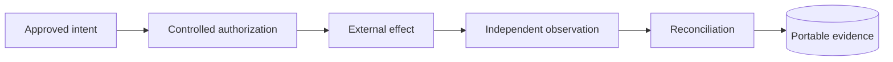

# ProdKit Control architecture

This directory defines the architectural contract for ProdKit Control. Start with the overview, then use the specialized documents for runtime behavior, deployment, extensions, security boundaries, and failure semantics.

## Reading order

1. [Architecture overview](overview.md) — objectives, ownership, layers, canonical record, trust boundaries, invariants, and profiles.
2. [Language-neutral contract authority](language-neutral-contract-authority.md) — normative specifications, schemas, protocols, shared conformance, native-runtime parity, and policy authority.
3. [Runtime and action flow](runtime.md) — service responsibilities and end-to-end action lifecycle.
4. [Product lineage model](lineage.md) — semantic intent-to-production graph and completeness assessment.
5. [Event model](event-model.md) — ordered audit/evidence history and integrity chain.
6. [Action and approval model](action-approval.md) — exact authorization semantics.
7. [Deployment architecture](deployment.md) — development, standalone durable, production, and enterprise profiles.
8. [Multi-tenancy and isolation](multi-tenancy.md) — tenant trust and enforcement boundaries.
9. [Extension architecture](extensions.md) — provider, executor, policy, orchestration, storage, and reconciler ports.
10. [Failure and recovery](failure-recovery.md) — crash, uncertainty, retry, reconciliation, and recovery semantics.
11. [Observability](observability.md) — operational telemetry, correlation, SLOs, and its boundary from canonical evidence.
12. [Portable attestations and assurance](attestations.md) — in-toto/SLSA interoperability, signed checkpoints, trust roots, retention locks, portable packages, and offline verification.
13. [High availability and scale](high-availability.md) — stateless replicas, fenced ownership, durable bounded work, failover safety, and graceful draining.
14. [Guarantees and non-guarantees](guarantees.md) — safe claim language and assurance prerequisites.
15. [Architecture Decision Records](decisions/README.md) — decision criteria, lifecycle, naming, and [ADR template](decisions/0000-template.md).

Security and operations continue in:

- [Threat model](../security/threat-model.md)
- [Secure deployment](../security/secure-deployment.md)
- [Operations runbook](../operations/runbook.md)
- [Capacity and overload envelope](../operations/capacity.md)
- [Roadmap](../../ROADMAP.md)

## Architecture doctrine

ProdKit Control exists to make that chain explicit, typed, durable, and independently verifiable.

Portable meaning is owned by language-neutral specifications, schemas, protocols, canonicalization profiles, and shared conformance vectors. Python and TypeScript are native implementations and neither runtime is normative authority.

## Current-versus-target rule

Architecture documents may describe both implemented behavior and target production profiles. When a capability is not implemented or not yet hardened, the documentation must say so. A future roadmap item is not a present guarantee, and the existence of an adapter package is not evidence that the adapter is production complete.

The exact release boundary is always defined by that release's notes, code, tests, and artifacts.

## Architecture changes

A change should receive an [Architecture Decision Record](decisions/README.md) when it materially changes one or more of:

- canonical source-of-truth ownership;
- portable semantic or language-neutral contract authority;
- authorization or trust boundaries;
- event/lineage compatibility;
- idempotency or external-effect semantics;
- tenant isolation;
- credential ownership;
- evidence integrity/trust anchoring;
- public adapter contracts;
- supported deployment profile;
- compatibility/migration guarantees.

ADRs should describe context, decision, alternatives, security/operational consequences, compatibility impact, and migration strategy. They do not replace the canonical architecture documents; accepted decisions should be reflected back into them.
