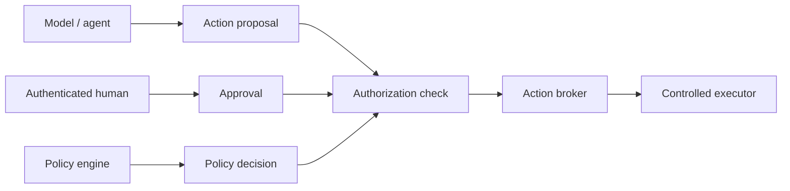
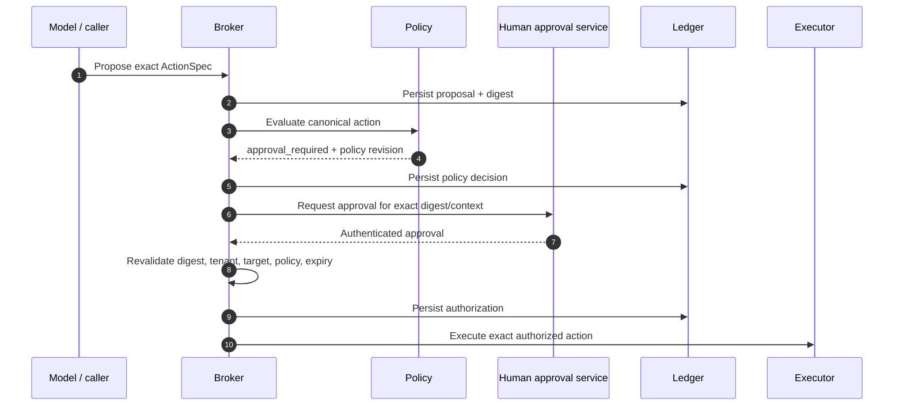

# Action and approval model

ProdKit Control separates **proposal**, **policy**, **human/organizational approval**, **authorization**, and **execution** so no model, client, or executor can silently collapse those responsibilities into one opaque tool call.

## Authority model

A model may propose an action and request approval. It cannot approve itself, mint a trusted human identity, or bypass the policy/broker path merely because a provider API labels a response as a tool call.

## Canonical action digest

`ActionSpec.digest` binds the risk-relevant action identity. The canonical digest includes or references, as applicable:

- action identity and schema/version;
- tenant and run;
- executor capability/implementation identity;
- operation name;
- effect and risk classification;
- target identity and environment;
- canonical arguments;
- expected effect;
- idempotency key;
- expiry;
- work pack/repository operation context;
- policy context and other configured authorization inputs.

The digest exists so an approval for one action cannot be reused after a material action mutation.

## Policy decision

Policy evaluation should be based on the exact canonical action/context, not a lossy natural-language summary.

A versioned decision should identify:

- policy engine/service identity;
- decision ID;
- policy bundle/revision;
- result (`deny`, `allow`, `approval_required`, or an equivalent explicit canonical result);
- required approval role/constraints where applicable;
- decision reason/reference evidence;
- decision time and relevant freshness/expiry.

If policy evaluation is required by the active profile and is unavailable or invalid, the broker fails closed.

## Approval binding

An approval is valid only while all bound context remains exact and fresh.

At minimum, production approval should bind:

- action digest;
- target digest/base state where required;
- target environment;
- policy decision ID and revision;
- tenant/organization;
- required approval role or authority;
- approval outcome;
- expiration;
- approver identity and authentication context/reference.

Changing a command argument, deployment artifact, base state, environment, tenant, policy revision, executor capability, or other bound risk input invalidates the approval.

## Approval sequence

The broker must revalidate the approval immediately before privileged execution as required by the implementation/profile. A stale approval is not made fresh merely because it was valid when originally issued.

## Human authority

Production applications must resolve human identities from a verified identity provider or trusted approval service. Arbitrary actor IDs supplied by a client/model are not sufficient evidence of human approval.

Recommended approval evidence includes:

- immutable approver subject ID;
- organization/tenant membership/role context;
- authentication/service identity reference;
- approval timestamp;
- explicit approved digest/context;
- expiry;
- decision/reference/ticket/reason when policy requires it.

Sensitive identity attributes should not be duplicated into event payloads beyond what the retention/privacy policy requires.

## Separation of duties

Higher-risk assurance profiles may require additional separation such as:

- proposer cannot be sole approver;
- executor service cannot self-authorize;
- policy administrator cannot retroactively mutate the decision used by an already executed action without an auditable new revision;
- two-person approval for selected effects;
- production approval restricted to designated roles/groups;
- break-glass approval requiring separate incident evidence.

These controls are profile/policy choices layered on the same canonical binding model.

## Target/precondition binding

For actions where concurrent external state matters, authorization should bind an expected target/base state.

Examples:

- Git ref currently points to commit X;
- deployment is currently revision Y;
- Kubernetes resourceVersion is Z;
- database schema/version/fingerprint matches a required precondition.

If the target changes before execution, the action may require re-planning, re-policy, and re-approval rather than executing against a different state than the approver reviewed.

## Expiry

Actions and approvals should have explicit expiry when stale execution creates risk. Expiry is checked using trusted server/runtime time; the model/client does not get to extend an approval without a new authorized record.

## Idempotency and approval

A retry of the **same exact approved action** may reuse an approval only if:

- the action digest is unchanged;
- approval/policy remains fresh;
- target/preconditions are still valid;
- the active policy permits reuse;
- retry is safe according to the previous execution outcome/idempotency state.

An uncertain non-idempotent action is not made retryable by a still-valid approval; reconciliation is still required.

## Denial

Policy denial and human approval denial are durable outcomes. A model may propose a materially changed action that is evaluated separately, but it must not loop on cosmetic mutations to evade a policy boundary.

Systems integrating ProdKit should consider rate limiting/escalation for repeated high-risk denied proposals.

## Break-glass

Enterprise deployments may define a break-glass path for emergencies. It should be stricter in evidence, not weaker:

- explicit emergency capability/role;
- bounded scope and time;
- reason/incident reference;
- strong authentication;
- complete event/evidence trail;
- post-action reconciliation and review;
- credential/capability revocation after use where practical.

Break-glass must not be a hidden generic bypass around the broker.

## Current implementation boundary

`v0.0.1` implements the canonical action digest, policy/approval contracts, approval binding, broker lifecycle, and fail-closed development authentication boundary. Production identity/approval service integration, workload identity, advanced separation-of-duties profiles, and enterprise administrative controls are roadmap-gated.
