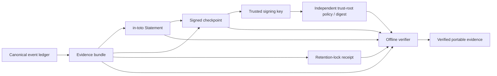

# Portable attestations and assurance

ProdKit Control v0.3.0 makes evidence independently portable without moving authority out of the control plane. The canonical event ledger, action lifecycle, policy decisions, approvals, execution records, observations, and reconciliation remain ProdKit-owned records. Attestations are a cryptographically bound interoperability layer over that evidence, not a replacement source of truth.

## Design goals

The portable assurance layer must support all of the following at the same time:

- verification without a running ProdKit service;
- transfer between organizations and security tooling;
- stable in-toto and SLSA wire identifiers;
- independent trust anchors instead of self-trusting archives;
- signing-key rotation and revocation;
- retention evidence whose assurance level is explicit;
- standalone operation without Sigstore or a hosted service;
- stronger enterprise profiles that require external signing and retention controls;
- forward compatibility for externally versioned standards while keeping ProdKit's own trust contracts strict.

## Trust chain

A package that merely contains its own public key is not trusted. `PortableEvidencePackageVerifier` requires either an independently supplied `TrustRootPolicy` or an independently supplied digest of the embedded trust policy. An optional package SHA-256 can provide an additional transport anchor.

## Standards boundary

ProdKit targets stable wire contracts:

- in-toto Statement `_type`: `https://in-toto.io/Statement/v1`;
- SLSA build provenance `predicateType`: `https://slsa.dev/provenance/v1`;
- ProdKit evidence predicate: `https://schemas.prodkit.dev/control/evidence/v1`;
- ProdKit checkpoint canonicalization: `prodkit-json-v1`.

The in-toto and SLSA models intentionally ignore unknown fields so later compatible standard revisions can be read without weakening core verification. ProdKit-owned `TrustRootPolicy`, `SignedCheckpoint`, `RetentionLockReceipt`, and `AssuranceProfile` models inherit the strict canonical contract policy and reject unknown or malformed authoritative fields.

`prodkit-json-v1` is a ProdKit canonicalization profile. It is not represented as RFC 8785 and it must not be confused with Sigstore/DSSE's own verification rules. A ProdKit checkpoint is signed over ProdKit canonical bytes. A Sigstore bundle is verified by Sigstore/Cosign semantics.

## Signed checkpoints

`SignedCheckpoint` binds:

- run and tenant identity;
- sequence number;
- final canonical event hash;
- evidence-bundle SHA-256;
- optional attestation SHA-256;
- previous-checkpoint SHA-256 for checkpoint chains;
- signer identity, key identity, and algorithm.

The standalone signer uses Ed25519. The private key never appears in the checkpoint or trust policy. Enterprise deployments may keep signing material behind KMS/HSM boundaries and use the same public checkpoint contract.

### Key rotation and revocation

A `TrustRootPolicy` can contain multiple uniquely identified signing keys. Each key has a validity start, optional validity end, and optional revocation time. Verification is fail closed when:

- the key id is absent or ambiguous;
- the checkpoint signer differs from the trusted key signer;
- an allowed-signer list excludes the signer;
- the checkpoint predates key validity or postdates its validity window;
- the checkpoint was created at or after the key's revocation time;
- the signature is invalid.

Historical signatures created before revocation may remain valid when `allow_historical_signatures_before_revocation` is enabled. Organizations that require revocation to invalidate all historical evidence can disable that behavior.

## Retention assurance

A `RetentionLockReceipt` binds an evidence-object digest to a provider reference, lock time, retention deadline, and lock mode. The receipt is evidence about a retention control; it does not magically make ordinary storage WORM.

Modes are explicit:

- `logical` — application-enforced retention; useful for standalone/development profiles but not immutable storage;
- `governance` — provider governance/object-lock semantics;
- `compliance` — provider compliance/object-lock semantics;
- `write_once` — a provider's write-once/immutable storage guarantee.

The default enterprise assurance profile requires a retention lock and accepts `compliance` or `write_once` modes for at least 30 days. Deployments can define stricter profiles. ProdKit does not claim compliance-grade immutability from a local filesystem.

## Portable evidence package

`PortableEvidencePackageBuilder` emits one bounded archive containing:

- `package-manifest.json`;
- `evidence.zip`;
- `attestation.json`;
- `checkpoint.json`;
- `trust-root.json`;
- `retention-lock.json`.

The package manifest records schema/version metadata, standard identifiers, and a SHA-256 for every payload member. The verifier rejects duplicate, missing, unexpected, oversized, malformed, or digest-mismatched members before evaluating trust.

After package integrity checks, verification continues through the independent trust-root anchor, checkpoint signature, key validity/revocation, evidence-bundle event chain, run and tenant binding, attestation subject digest, optional attestation binding from the checkpoint, and retention profile.

## Sigstore integration

`prodkit-sigstore` is an optional external signing/verification adapter. It executes Cosign with argv rather than a shell, enforces timeout and non-zero-exit failure, and supports blob bundles, key-based verification, keyless certificate identity plus OIDC issuer constraints, custom trusted roots, and offline verification.

Sigstore is not required for standalone verification: the built-in Ed25519 checkpoint path is deliberately independent. When an assurance profile or organizational policy requires Sigstore, signing/verification failure must prevent the evidence from being promoted as satisfying that profile.

## Cross-version behavior

v0.3.0 preserves the existing evidence-bundle schema used by v0.2.0 and adds portable assurance around it. Tests explicitly verify a v0.2-format evidence bundle under a v0.3 checkpoint, trust policy, attestation, and retention receipt. Future evidence schemas must either remain verifiable through a declared compatibility path or fail with an explicit unsupported-schema error; they must never be silently accepted as equivalent.

## Security invariants

1. An embedded trust root is never sufficient by itself.
2. A signature is meaningful only when the key, signer, validity interval, revocation policy, and subject digests all match.
3. Unknown/missing trust evidence never becomes success.
4. Telemetry is not canonical evidence.
5. MCP/agent requests are proposals, not authorization.
6. External policy engines may strengthen a decision but cannot weaken a stricter ProdKit decision when composed through the conjunctive engine.
7. Retention assurance names the actual storage control; local storage is not mislabeled as compliance/WORM.
