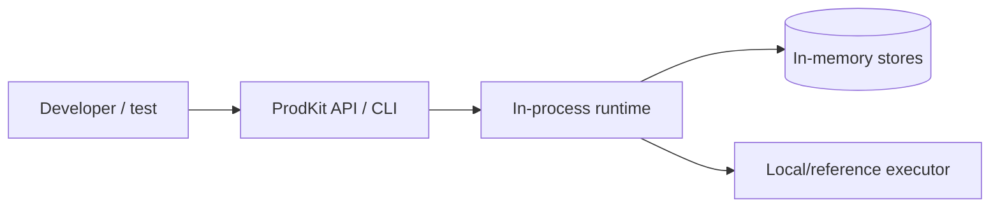
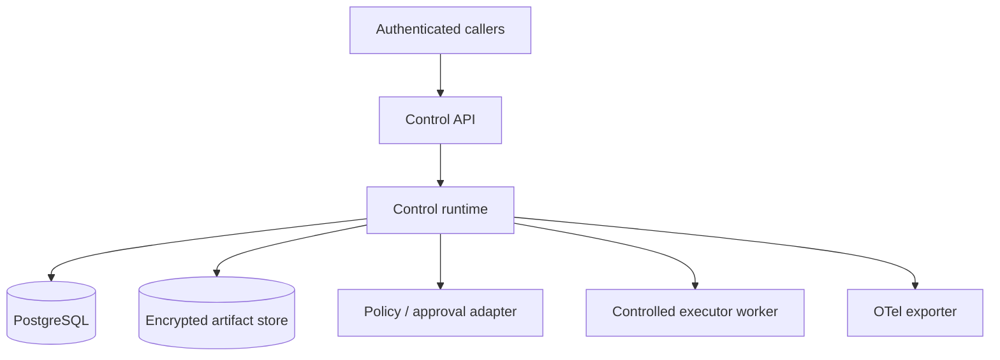
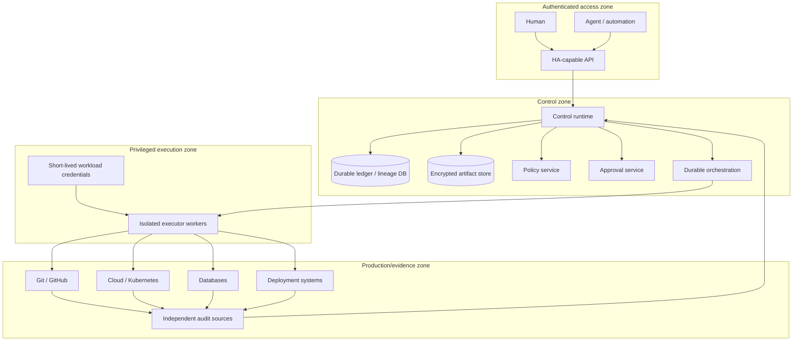
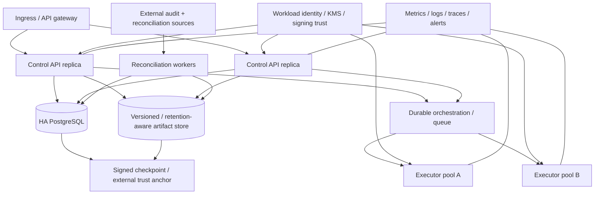

# Deployment architecture

ProdKit Control defines deployment profiles so that **standalone**, **production**, and **enterprise** describe concrete properties rather than vague maturity claims.

The profiles are cumulative. An enterprise deployment includes the production controls below it; a development profile must not be represented as enterprise-ready merely because it exposes the same API contracts.

## Profile 1 — Development/reference

Purpose: local evaluation, package development, examples, and deterministic tests.

Typical characteristics:

- in-memory or disposable persistence;
- explicitly enabled insecure development principal resolver;
- local/reference executors;
- no production credentials;
- deterministic demos and tests;
- evidence bundle verification for development use.

This profile is intentionally **not production-ready**.

## Profile 2 — Standalone durable

Purpose: durable controlled use without depending on another ProdKit product.

Required properties:

- durable ledger/idempotency/service state;
- durable artifact storage appropriate to retention mode;
- authenticated principal resolution;
- explicit tenant and authorization enforcement;
- configured policy and approval behavior;
- controlled executor boundary;
- operational backup/restore plan;
- no reliance on process memory for safety-critical recovery.

A deployment is **standalone-capable** when its core behavior does not require another ProdKit application. PostgreSQL, object storage, OIDC, a policy engine, or an orchestrator are external infrastructure behind ports and do not make the product non-standalone.

## Profile 3 — Production control

Purpose: safely route real production actions through ProdKit Control.

Required properties beyond standalone durable:

- isolated privileged executor workers;
- short-lived, least-privilege workload credentials supplied at execution time;
- network policy preventing models/agents from bypassing the broker to production control planes;
- durable idempotency and uncertain-outcome recovery;
- fail-closed policy and approval integrations;
- independent observation/reconciliation for supported high-risk actions;
- signed/trusted evidence anchors where required by the chosen assurance level;
- encrypted artifact retention and secret/redaction controls;
- operational dashboards, alerts, incident procedures, and capacity expectations;
- migration and rollback/forward-fix procedures.

## Profile 4 — Enterprise assurance

Purpose: operate the supported production profile with verified security, availability, lifecycle, and governance controls suitable for serious enterprise adoption within documented boundaries.

Required properties beyond production control:

- defined availability and supported scale envelope;
- tested concurrency, failover, fencing, and graceful rollout behavior;
- backup/restore and disaster-recovery procedures with validated RPO/RTO targets;
- multi-tenant isolation verification for multi-tenant deployments;
- audited administrative elevation and break-glass behavior;
- retention, deletion, export, and legal-hold policy;
- key rotation and trust-root migration procedures;
- supported migration/deprecation/compatibility policy;
- SLOs, alerting, capacity management, and incident ownership;
- independent security review and threat-model closure for the supported profile.

## Network and credential boundaries

Production deployments should follow these rules:

1. Public/client traffic terminates before the control runtime and is authenticated/authorized.
2. Agents/models never receive reusable production credentials.
3. The broker authorizes exact actions but does not expose general-purpose privileged credentials.
4. Executor workers are isolated from caller/model code and receive bounded credentials just in time.
5. Direct network paths from untrusted agent execution environments to production control planes are denied where feasible.
6. Database/object-store credentials are service-scoped and least privilege.
7. Reconciliation may require read-only access to independent audit/control sources distinct from executor credentials.
8. Signing/trust-root material is managed separately from ordinary application secrets when stronger assurance is required.

## Storage responsibilities

### PostgreSQL

Production durable state may include:

- runs and identities;
- append-only events;
- lineage nodes/relations or durable projections thereof;
- policy/approval references;
- action and execution-attempt state;
- idempotency claims;
- reconciliation cursors/results;
- configuration and migration metadata.

Database projections must not permit convenient mutable tables to silently replace the append-only canonical semantics.

### Artifact/object storage

Artifact storage may hold encrypted full/redacted content, evidence payloads, bundles, snapshots, and signed exports according to retention policy. Content identity remains deterministic even when storage location or encryption envelope changes.

### External trust anchors

A database hash chain detects tampering relative to a trusted anchor. Stronger profiles should export signed checkpoints/archive digests to a separately controlled retention/trust system so an administrator cannot replace both the history and its only anchor without detection.

## Orchestration

A durable workflow engine is optional at the core architecture level but strongly useful for production recovery, scheduling, retry coordination, and reconciliation. Orchestration state is operational state; the portable assurance record remains the canonical events/lineage/artifacts and trusted anchors.

## Scaling principles

- Keep API surfaces stateless where practical.
- Use durable ownership/leases/fencing for single-owner work.
- Never rely on load-balancer affinity for idempotency correctness.
- Apply backpressure before privileged executor capacity is exhausted.
- Bound concurrency by target/risk class where appropriate.
- Preserve per-action causal ordering even when unrelated actions execute concurrently.
- Make reconcilers restartable from durable cursors/checkpoints.

## Upgrade principles

Production upgrades must account for:

- database schema compatibility;
- event/schema version readers/writers;
- in-flight actions and workflow state;
- executor protocol compatibility;
- policy/approval contract compatibility;
- evidence bundle verification across supported versions;
- rollback safety when a newer writer has emitted data an older binary cannot understand.

By 1.0, the supported upgrade matrix and deprecation policy must be explicit.

## Disaster recovery principles

A restore is not complete merely because services start. Recovery must establish that:

- canonical history is intact;
- trusted anchors/checkpoints still verify;
- artifact references resolve or are explicitly classified missing;
- idempotency/execution-attempt state is restored;
- in-flight/uncertain external actions are reconciled rather than replayed blindly;
- tenant/policy/security configuration is consistent;
- recovery actions themselves are audited.

## Deployment claim language

Use deployment claims precisely:

- **Development/reference** — suitable for evaluation and testing.
- **Standalone durable** — durable and authenticated, but not automatically sufficient for production assurance.
- **Production control** — hardened for the explicitly supported production action profile after its release gates are met.
- **Enterprise assurance** — adds verified HA, DR, tenancy/governance, lifecycle, security, and review requirements.

`v0.0.1` is the canonical engineering foundation and does not yet satisfy the complete production or enterprise profiles described here.
