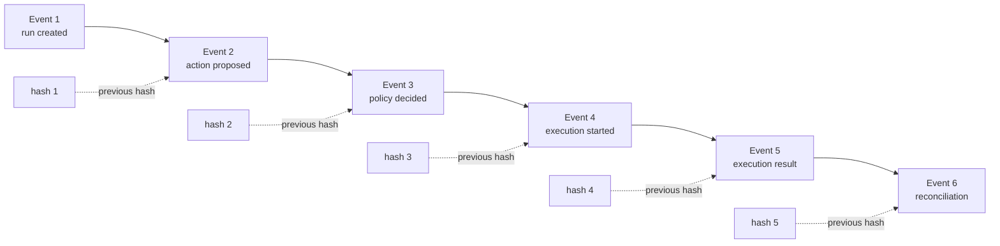
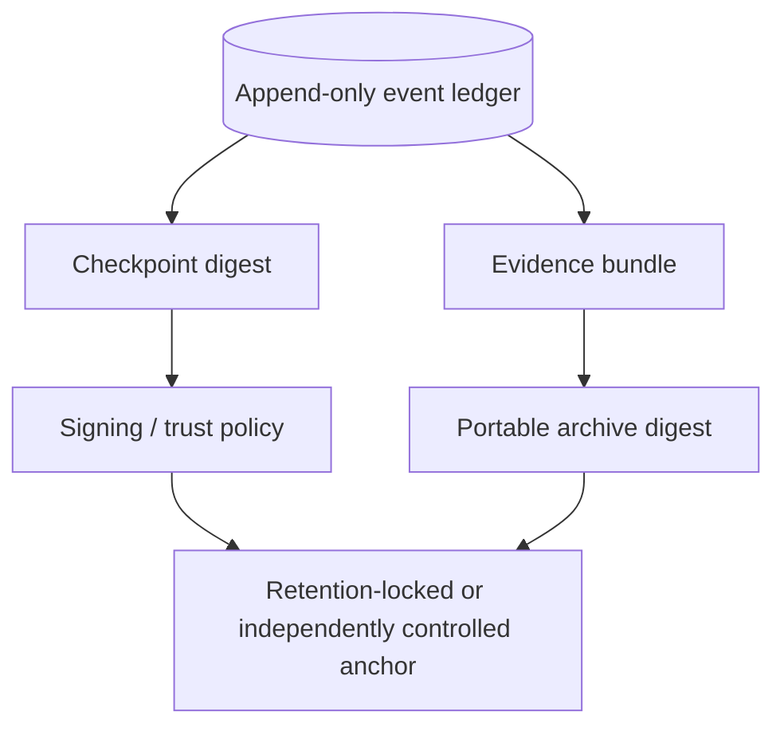
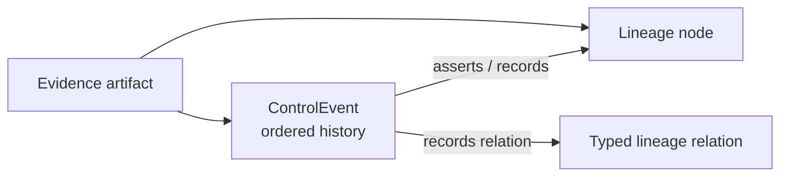

# Event model

`ControlEvent` is the ordered record of how assertions, decisions, actions, observations, corrections, and reconciliation results entered ProdKit Control. It answers **when, by whom, because of what, and with which evidence** something became part of the canonical record.

The event ledger complements the semantic `LineageGraph`: events preserve ordered history and causality; lineage expresses durable product relationships.

## Event sequence

Each run owns a contiguous event sequence beginning at one.



## Canonical event fields

An event contains or references:

- stable schema name and version;
- event, run, tenant, action, execution-attempt, trace, span, causation, and correlation identities where applicable;
- event type and timezone-aware timestamps;
- authenticated requesting/recording actor identity;
- typed/versioned payload data;
- typed lineage-node references for assertions affected by the event;
- evidence/artifact references;
- previous-event hash and current-event hash;
- optional signature and signing-key/trust identity.

Not every event needs every optional identity, but correlation fields must be explicit when they exist rather than hidden in free-form payloads.

## Deterministic integrity

The reference implementation computes the event hash over canonical JSON:

```text
event_hash = SHA256(canonical_json({
  "event": event_without_integrity,
  "previous_event_hash": previous_event_hash
}))
```

Canonical serialization must be deterministic so independent implementations can reproduce the same digest for the same semantic record.

## What hash chaining proves

Given a trusted anchor/final digest, hash chaining can detect:

- insertion of an event;
- deletion of an event;
- modification of an event;
- reordering of events;
- substitution of an earlier event chain that does not match the trusted anchor.

It does **not** by itself prevent an administrator who controls both storage and the only anchor from replacing an entire history with a newly computed chain.

## Trust anchoring

Higher-assurance deployment profiles should periodically bind the ledger to an independently controlled trust anchor.



Possible anchors include signed checkpoints, externally retained archive digests, transparency-style logs, or another organization-controlled immutable/retention-locked system.

The architecture does not require one specific signing vendor; the assurance profile must document which trust mechanism is actually supported and verified.

## Append-only corrections

Events are never edited to “fix history.” A correction:

1. references the incorrect/superseded event or assertion;
2. records the authenticated correction actor and reason;
3. appends the corrected assertion as a new event;
4. preserves the original event in the chain;
5. lets projectors compute the effective view while retaining historical evidence.

This avoids turning a mutable query table into an unaudited rewrite mechanism.

## Causation and correlation

Causation answers **which earlier event caused this event**. Correlation groups related work that may not be in a strict parent-child chain.

Examples:

- action proposal causally leads to policy decision;
- policy decision and human approval causally lead to authorization;
- execution attempt causally leads to result/uncertain state;
- deployment and audit events may correlate through an external operation/deployment ID;
- reconciliation can correlate an external record that was produced outside the current process lifetime.

Trace/span IDs can be carried for observability correlation but do not replace canonical causation/event identity.

## Event type evolution

Pre-1.0 event schemas may evolve, but changes should follow these rules:

- version schemas explicitly;
- avoid changing the meaning of an existing version in place;
- readers should reject unsupported security-critical semantics rather than guess;
- evidence bundles should retain enough schema/version metadata for offline verification;
- migrations/projectors may derive new read models without rewriting original events;
- 1.0 should publish supported compatibility/deprecation rules.

## Event ordering and concurrency

Global serialization across unrelated tenants/runs is not required. The canonical guarantee is scoped ordering where semantics require it, especially within a run/action chain.

Production storage should prevent duplicate sequence ownership and ensure two writers cannot silently create incompatible events at the same logical position. The precise database transaction/locking strategy is implementation-specific.

## Sensitive content

Events should prefer references/fingerprints over embedding unrestricted sensitive payloads. Secrets, raw credentials, unrestricted prompts, and personal/sensitive content should be retained only according to the configured artifact/redaction policy.

An event may prove that artifact digest `X` participated without placing the entire artifact in the ledger.

## Relationship to lineage



Events answer *how/when an assertion entered the system*. Lineage answers *what durable semantic relationship exists between product identities*. Evidence bundles carry both where available.

## Relationship to projections

Query tables, dashboards, search indexes, analytics, and OpenTelemetry are projections. They may be rebuilt from canonical data where enough source material is retained. A projection can be updated for convenience; the event chain is not edited to match the projection.

## Production requirements

For a production profile, the event layer should provide:

- durable append semantics;
- deterministic canonical hashing;
- transactionally safe sequence ownership;
- tenant enforcement;
- schema/version validation;
- integrity verification tooling;
- backup/restore that preserves order/integrity;
- externally trusted checkpoints/archives where required;
- unsampled canonical recording of required control events.

`v0.0.1` provides the canonical event contract, deterministic hashing, hash-chained reference ledger, and evidence-bundle semantics. Durable enterprise anchoring/HA/DR are roadmap-gated.
