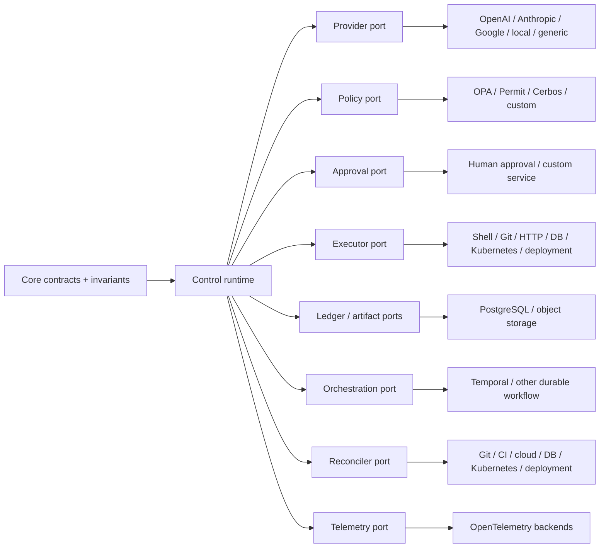

# Extension architecture

ProdKit Control is provider-neutral by construction. External vendors and delivery systems integrate through explicit capability contracts so the core control semantics do not depend on one model provider, policy engine, cloud, workflow engine, storage backend, or observability system.

## Ports and adapters

The exact adapter catalog can grow. The core must not require consumers to adopt a specific implementation from any category.

## Provider adapters

Provider adapters normalize model/provider activity into canonical evidence such as:

- provider/model identity and version where available;
- request/response IDs;
- prompt/input artifact references according to retention policy;
- tool/action proposals;
- token/cost/latency metadata as operational evidence;
- provider-specific safety or finish metadata when useful.

Provider adapters **must not execute tools or grant authority**. A tool call emitted by a model is still only an action proposal until it passes the canonical control lifecycle.

## Executor adapters

Executors are privileged effectors. They implement explicit capabilities and should expose enough evidence for the broker/reconciler to classify outcomes.

An executor contract should make clear:

- supported operation names/capabilities;
- target identity format;
- canonical argument schema;
- risk/effect classification expectations;
- idempotency behavior;
- timeout/cancellation semantics;
- external operation/request identity;
- before/after observation capabilities;
- success/failure/uncertain classification;
- credential requirements;
- whether independent reconciliation is available.

Production executor implementations must not silently broaden an approved operation into a more privileged action.

## Reconciler adapters

Reconcilers query independent or authoritative external sources and compare them with canonical ProdKit assertions. A reconciler should define:

- source identity and trust level;
- required read permissions;
- cursor/checkpoint semantics;
- freshness expectations;
- mapping from external identities to canonical action/deployment identities;
- match/mismatch/unverifiable/conflict behavior;
- rate limit/backoff strategy;
- evidence retention and redaction rules.

A missing external record is not automatically proof that nothing happened; the profile must define how source unavailability and retention gaps are classified.

## Policy adapters

Policy adapters evaluate canonical action/risk/context inputs and return versioned decisions. They should expose:

- policy engine identity;
- policy bundle/revision identity;
- decision ID;
- allow/deny/approval-required result;
- required approval role/constraints where applicable;
- reason/reference data suitable for audit;
- decision expiry/freshness rules if relevant.

Production behavior is fail closed when a required policy decision cannot be obtained or verified.

## Approval adapters

Approval adapters represent authenticated human or organizational authority. Approval evidence must bind to the exact canonical action and policy context. The adapter must not trust arbitrary model/client actor IDs as human approval identity.

## Storage adapters

Storage adapters must preserve semantics, not just shape.

For example, a ledger backend must preserve append-only ordering/integrity behavior; an artifact store must preserve content identity; a query store must not become an untracked mutable substitute for canonical history.

## Orchestration adapters

Workflow/orchestration adapters may provide:

- durable scheduling;
- retries/backoff;
- timers/expiry;
- child workflows;
- task routing;
- long-running reconciliation;
- recovery after worker restart.

They do not own the portable assurance semantics. A Temporal history, queue record, or scheduler database is operational evidence, not a replacement for canonical events/lineage/artifacts.

## Identity adapters

Production identity integration should produce a trusted principal containing the tenant/organization context and actor/service identity required by authorization. The adapter boundary may support OIDC, workload identity, SPIFFE-compatible identities, cloud-native service identity, or another verified mechanism.

The runtime must not assume a particular IdP, but it must assume that production principal identity is verified outside untrusted request fields.

## Telemetry adapters

OpenTelemetry and other observability adapters project runtime events into operational systems. They may be sampled or transformed; they therefore cannot be the authoritative audit ledger.

## Adapter maturity levels

Every adapter package should be classified rather than implicitly treated as production-ready:

| Level | Meaning |
| --- | --- |
| Contract | Interface/schema/package boundary exists |
| Reference | Demonstrates integration semantics, suitable for development/testing |
| Hardened | Durable error handling, security controls, and integration tests exist |
| Production-supported | Meets documented production profile and compatibility/support policy |
| Enterprise-validated | Meets additional scale, isolation, operations, and review gates where applicable |

Documentation and package metadata should avoid calling a `Contract` or `Reference` adapter production-ready.

## Compatibility rules

Adapters must not weaken these core semantics:

1. canonical action identity remains deterministic;
2. policy/approval remains exact and fail closed;
3. tenant identity remains authoritative;
4. uncertain external effects remain distinguishable from known failure;
5. idempotency conflict remains detectable;
6. canonical evidence remains independently exportable;
7. adapter-specific IDs are recorded as evidence, not substituted for canonical IDs;
8. provider/vendor metadata may enrich but not redefine authorization;
9. external source unavailability is represented explicitly;
10. secrets/credential material are never required in canonical event payloads.

## Adding an adapter

A new adapter should document:

- capability and non-capability boundaries;
- external API/version assumptions;
- identity/authentication method;
- required permissions;
- failure and uncertainty modes;
- idempotency semantics;
- evidence mapping;
- redaction/retention behavior;
- rate limits/backoff;
- test strategy and fixtures;
- supported maturity level.

Adapters that can cause production effects should also document sandbox/isolation expectations and independent reconciliation options.

## Standalone guarantee

The existence of first-class adapters does not make ProdKit Control dependent on them. The canonical core and evidence verification model must remain usable with custom adapters that honor the same contracts and invariants.
