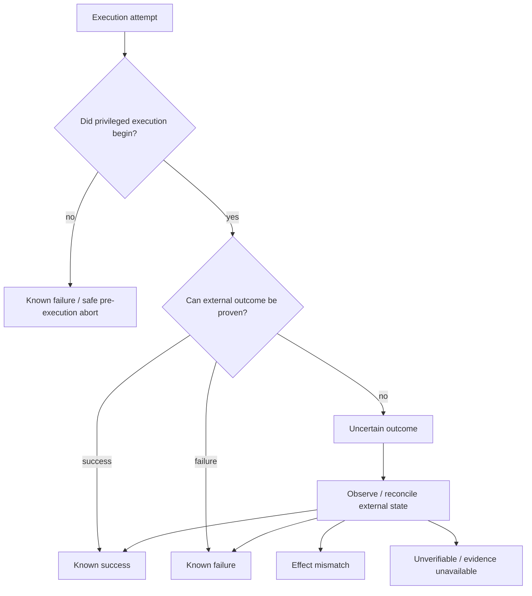
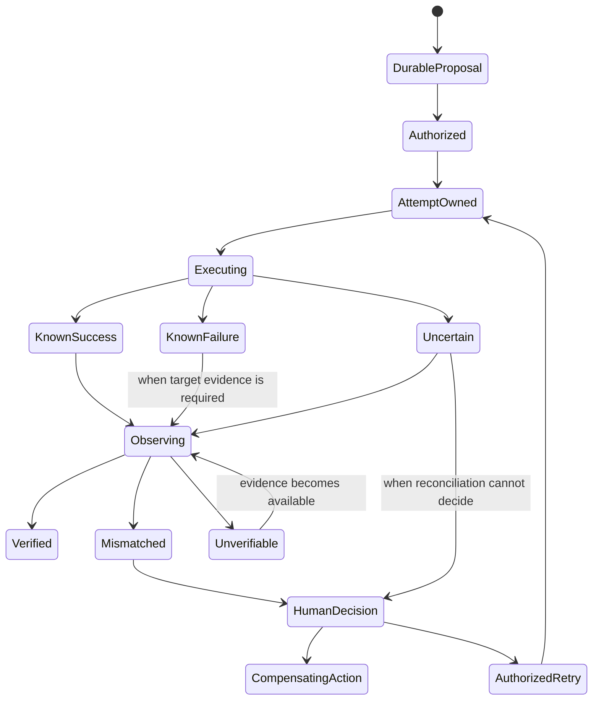

# Failure and recovery

ProdKit Control treats failure semantics as part of the assurance model. A production control plane is not safe merely because it can retry; it must know when retry is safe, when an effect may already have happened, and what evidence is required to recover.

## Outcome taxonomy

The critical distinction is whether the external side effect can be proven. A timeout, process crash, network reset, or worker loss after the target accepted a request can be `uncertain` even if the local process reports an exception.

## Failure classes

### Validation failure

The action never became eligible for execution because a canonical contract, schema, target, tenant, or precondition was invalid. No privileged side effect should have begun.

### Policy/approval failure

Authorization was denied, unavailable, stale, expired, or mismatched. The action must not execute.

### Pre-execution infrastructure failure

The action was authorized but the system can prove no executor-side effect began—for example, no worker acquired the durable execution claim. Retry may be safe after authorization freshness checks.

### Known execution failure

The executor/target provides trustworthy evidence that the operation failed without the prohibited side effect. Retry policy still depends on target semantics and authorization freshness.

### Uncertain execution

The system cannot prove whether the external effect happened. Examples:

- worker crash after sending the request;
- timeout after target acceptance;
- network failure before response persistence;
- target returns an ambiguous asynchronous response;
- process loses state after an external commit but before recording success.

Uncertain outcomes retain their idempotency ownership and require reconciliation before unsafe retry.

### Effect mismatch

The external action completed, but observed state does not match the approved/expected effect. This is not a successful execution merely because the API returned 2xx.

### Evidence failure

The effect may be correct, but required observation/reconciliation evidence is unavailable, stale, invalid, or conflicting. Strict assurance profiles must classify this explicitly rather than converting it to success.

### Integrity failure

Hash, signature, sequence, identity, lineage, or trusted-anchor validation fails. New privileged actions for the affected scope should fail closed until the integrity incident is understood.

## Recovery state machine

A compensating action is a new controlled action with its own policy, approval, evidence, and lineage. ProdKit does not erase the original effect from history.

## Idempotency recovery

A durable idempotency record should prevent two different workers or retries from executing the same logical action concurrently.

Required behavior:

- same key + same canonical action digest may resolve to the existing attempt/result;
- same key + different action digest is a conflict;
- uncertain attempts retain ownership until reconciled or explicitly resolved;
- leases may expire for worker liveness, but lease expiry alone must not mean the external effect did not happen;
- failover must use fencing/ownership semantics where concurrent execution would be unsafe.

## Crash matrix

| Crash point | Expected recovery |
| --- | --- |
| Before durable proposal | Caller can resubmit; no canonical effect exists |
| After proposal, before authorization | Resume/re-evaluate policy according to freshness rules |
| After approval, before execution ownership | Reuse approval only if still exact and fresh |
| After execution ownership, before target call | Recover owner/lease state and prove no call began before retry |
| During target call | Mark/recover as uncertain unless target evidence proves outcome |
| After target commit, before local result persistence | Reconcile by external operation/state identity |
| After result, before observation | Resume observation/reconciliation |
| During reconciliation | Resume from durable cursor/identity; do not re-execute action |
| During evidence export | Rebuild/export from canonical record; verify bundle digest |

## External-operation identity

Whenever a target system exposes a stable request/transaction/workflow/deployment identity, record it. It is one of the strongest recovery aids for determining whether an uncertain attempt reached the target.

Examples include:

- Git commit SHA / ref update identity;
- GitHub request/workflow/deployment ID;
- cloud request or operation ID;
- Kubernetes UID/resourceVersion;
- database transaction/audit identity;
- deployment revision;
- target-native idempotency token.

These external IDs are evidence references; they do not replace canonical action identity.

## Reconciliation after uncertainty

Reconciliation should answer:

1. Did the external operation occur?
2. If it occurred, was it caused by the expected identity/request?
3. Does current/observed state match the approved expected effect?
4. Did any additional/unapproved effect occur?
5. Is the available evidence sufficiently fresh and trustworthy for the selected assurance profile?

Possible results are `matched`, `mismatched`, `not_observed`, `unverifiable`, or another explicit domain-specific status. Unknown must remain distinguishable from match.

## Retry rules

A retry is allowed only after checking:

- the previous outcome classification;
- native target idempotency behavior;
- durable idempotency ownership;
- target preconditions/base state;
- current policy revision;
- approval freshness/expiry;
- target/environment identity;
- whether a compensating action or human decision is required.

Blind automatic retry of an uncertain non-idempotent production action is prohibited by the architecture.

## Reconciliation lag and eventual evidence

Some external audit sources are eventually consistent. The runtime should support a bounded `pending observation` period rather than marking an immediate mismatch when evidence is known to lag.

The profile should define:

- expected evidence latency;
- retry/backoff window;
- maximum age before evidence becomes stale;
- when to alert/escalate;
- when a result becomes `unverifiable`.

## Control-plane failover

HA does not change the action semantics. After API/runtime failover:

- durable canonical state determines what work exists;
- single-owner execution uses lease/fencing or equivalent control;
- stale workers cannot overwrite newer ownership/result state;
- external effects are reconciled when ownership history is ambiguous;
- a new node does not assume an action is safe to repeat merely because local memory is empty.

## Database/storage failure

If canonical durability required for the active assurance profile is unavailable, new production effects should fail closed rather than continue with only transient process memory.

Read-only status/diagnostic behavior may continue when safe, but must not fabricate freshness or completeness.

## Integrity recovery

On an integrity mismatch:

1. stop or isolate new high-risk actions for the affected scope;
2. preserve database/object-store/log/signing/audit evidence;
3. compare against the latest independently trusted checkpoint/archive digest;
4. locate the first inconsistent event/artifact/reference;
5. determine whether corruption, software defect, key compromise, or unauthorized mutation occurred;
6. append incident/correction records rather than rewriting history;
7. rotate compromised trust material as required;
8. re-establish a trusted checkpoint before resuming the affected assurance profile.

## Disaster recovery

Disaster recovery must restore **assurance state**, not merely application availability. A valid DR exercise proves that restored ledger/lineage/artifact references verify, trusted anchors remain meaningful, in-flight actions are classified safely, idempotency state survives, and reconciliation can re-establish the relationship with external production state.

## Current implementation boundary

`v0.0.0` defines core uncertain-outcome and idempotency semantics and reference behavior. Durable crash recovery, lease/fencing, full production reconciler coverage, and enterprise DR exercises are roadmap-gated capabilities.
