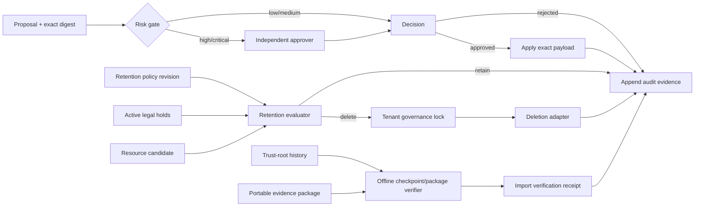

# Governance, retention, and lifecycle architecture

ProdKit Control v0.6.1 maintains the v0.6 provider-neutral governance plane around long-lived control evidence and high-risk configuration. It does not replace the canonical ledger, tenant-isolation controls, or portable assurance primitives introduced earlier; it governs how those controls change over time.

## Design invariants

1. **Policy changes are evidence, not hidden configuration edits.** A governed change records target, exact proposed digest, expected current digest, risk, reason, ticket, proposer, approval, and application time.
2. **High and critical risk require four-eyes approval.** The proposer cannot approve the same high/critical change.
3. **Support elevation cannot mutate governance.** PostgreSQL may permit support-mode reads/exports only after live v0.5 grant revalidation. The standalone governance store fails closed for support mode because it has no independent live-grant registry.
4. **Legal hold wins over retention deletion.** Hold placement/release and deletion authorization serialize through the same tenant governance lock. The PostgreSQL schema also blocks tenant deletion whenever any scoped governance hold is active.
5. **Retention is policy-versioned.** Decisions name the exact retention policy ID and revision used. Policy revisions are append-only.
6. **Deletion is an external effect.** The governance service determines eligibility; a `RetentionDeletionAdapter` performs the provider-specific delete while consuming the exact decision. Adapters must be bounded and idempotent at their provider boundary.
7. **Trust history is retained.** Rotation never rewrites historical signing policy. The prior trust root receives a retirement boundary and historical checkpoints continue to select the root that covered their signing time/key.
8. **Imports require independent verification.** A portable package is verified offline against an independently supplied trust-root policy or digest before import evidence is accepted.
9. **Migration claims are bounded.** v0.6 directly supports PostgreSQL schema 5→7 and 6→7. Older installations must follow an earlier supported upgrade path first.
10. **Governance evidence is append-only where correction would destroy meaning.** Approvals, policy revisions, transfer/import receipts, retention executions, audit events, and migration evidence cannot be updated or deleted in the PostgreSQL profile.

## Control flow

## Standalone and durable profiles

The standalone `InMemoryGovernanceStore` implements the same proposal, approval, retention, legal-hold, rotation, transfer, and audit semantics for embedded use and deterministic qualification. It deliberately rejects support-elevation contexts because it cannot revalidate a separate grant registry.

The production profile uses `PostgresGovernanceStore` and schema version 7. PostgreSQL adds tenant-scoped advisory serialization, constrained lifecycle transitions, append-only evidence, immutable tenant ownership, scoped-hold enforcement against tenant deletion, and live support-grant revalidation for permitted read/transfer operations.

## Retention model

`RetentionPolicy` is a tenant-local revision stream. Rules may define a retention duration, deletion grace period, or a permanently non-deletable resource class. A missing duration means indefinite retention. A legal hold can target all resources, a set of resource types, specific resource IDs, or an intersection of type and ID constraints.

A retention decision is not itself a delete. Destructive `execute_retention` rejects caller-supplied evaluation time and uses authoritative current time. PostgreSQL first evaluates under the tenant governance lock and commits append-only deletion intent. It then reacquires the same lock, re-reads current policy and legal holds, and invokes the adapter only if the exact governed eligibility still holds. A hold or policy change committed first therefore cancels deletion. If the provider effect or final persistence is ambiguous, the pre-committed intent remains durable reconciliation evidence rather than disappearing with a rolled-back execution transaction.

## Legal-hold model

Placing a hold requires `LEGAL_HOLD`. Releasing a hold is intentionally stronger: the release intent is content-addressed, classified `critical`, and must receive an independent governance approval before the hold can transition from `active` to `released`. PostgreSQL rejects all other hold transitions and prevents the JSON scope document from being rewritten during release.

Any active scoped governance hold also blocks v0.5 tenant lifecycle deletion at the database layer, preventing whole-tenant deletion from bypassing record-level preservation.

## Key and trust-root rotation

A governed trust root stores the exact `TrustRootPolicy`, its SHA-256 digest, revision, activation time, optional retirement boundary, and change request. Rotation must advance by exactly one revision and bind the approved request to the current policy digest. During an overlap window the old root remains valid for historical/overlapping signatures; key ID plus signing time selects a unique trust policy or verification fails closed.

This release manages trust-root policy history. It does not pretend to be an HSM/KMS. Actual private-key custody remains behind signer/provider boundaries and should use the deployment's approved key-management system.

## Evidence portability

`EvidenceTransferManifest` binds tenant, source control/schema version, portable-package SHA-256, evidence-bundle manifest SHA-256, optional trust-root revision, and legal-hold preservation intent. `GovernanceEvidenceTransferVerifier` verifies the portable package offline using the existing v0.3 assurance verifier and an independent trust root/digest, then binds the result to a typed `EvidenceTransferVerification`.

An import must also satisfy the v0.6 compatibility window. The import API consumes the exact `EvidenceTransferVerification`; the resulting receipt binds its verification ID, canonical verification digest, and trust-anchor digest. A caller cannot create authoritative import evidence merely by supplying matching archive metadata. Verification still does not automatically make imported evidence authoritative for a production decision; consumers must preserve source identity, trust anchors, and any applicable legal hold/retention metadata.

## Compatibility boundary

Schema 7 is additive over schema 6. v0.6 qualification constructs real schema-5 and schema-6 databases in isolated PostgreSQL schemas, preserves canonical run data through upgrade, applies every intermediate migration, verifies schema 7 governance tables, and proves migration evidence is append-only.

See [Compatibility and deprecation](../compatibility.md) and [Governance operations](../operations/governance-lifecycle.md).

## Non-guarantees

v0.6 does not claim disaster recovery, RPO/RTO, regional failover, backup restoration, or break-glass recovery; those are v0.7 gates. It also does not claim the v0.5 tenant-isolation profile has received an independent external security review until such a review is actually recorded.
