# Guarantees and non-guarantees

ProdKit Control uses **profile-scoped guarantees**. A design objective is not a runtime guarantee, and a runtime guarantee is only as strong as the deployment controls required to make it true.

This document defines what ProdKit Control is designed to guarantee, which prerequisites those guarantees depend on, and which claims are unsafe without stronger deployment evidence.

## Guarantee model

```mermaid
flowchart LR
    Contracts[Canonical contracts] --> Runtime[Correct runtime behavior]
    Runtime --> Durable[Durable storage / idempotency]
    Durable --> Credentials[Controlled credentials / executors]
    Credentials --> Evidence[Independent observation / reconciliation]
    Evidence --> Anchors[Trusted checkpoints / retention]
    Anchors --> Operations[HA / DR / governance / review]
    Operations --> Assurance[Enterprise assurance claim]
```

Removing a lower-level prerequisite weakens every claim above it.

## Designed guarantees

With the required deployment controls enabled, ProdKit Control is designed to provide:

- ordered reconstruction of routed actions and control decisions;
- exact policy and approval provenance;
- deterministic action and artifact fingerprints;
- typed linkage from specification revisions through observed production state;
- fail-closed assessment of required production-lineage stages;
- duplicate-side-effect protection through durable idempotency semantics;
- explicit classification of ambiguous/uncertain external effects;
- before/after evidence and effect verification where supported;
- mismatch detection against independent audit/control systems;
- provider-independent evidence export and offline verification;
- explicit detection of unexpected external activity when reconciliation sources cover it;
- tenant-scoped authorization and evidence ownership when the deployment profile enforces it.

## Guarantee prerequisites

### Ordered reconstruction

Requires durable append semantics, deterministic event identity/hash behavior, and preservation of the relevant artifact/evidence references.

### Exact authorization provenance

Requires canonical action digests, versioned policy decisions, authenticated approval identity, freshness/expiry validation, and execution through the broker.

### Duplicate-effect protection

Requires durable idempotency ownership and target/executor semantics that allow the runtime to distinguish known failure, success, and uncertainty. It does not mean every arbitrary external API is magically idempotent.

### Production lineage completeness

Requires the selected profile to define required stages/evidence and requires external activity to be visible to reconciliation if the claim extends beyond actions routed through ProdKit.

### Tamper evidence

A local hash chain proves consistency relative to a trusted anchor. Stronger claims against administrative replacement require signed or independently retained anchors/checkpoints that an attacker cannot replace together with the canonical store.

### Tenant isolation

Requires authoritative tenant derivation and enforcement at every relevant storage, query, task, policy, approval, artifact, executor, and reconciliation boundary. Merely placing `tenant_id` on a schema is not sufficient.

## Non-guarantees

ProdKit Control cannot guarantee completeness or correctness when:

- agents or humans possess credentials that bypass controlled executors;
- external production activity is outside all configured reconciliation/audit sources;
- audit sources are disabled, stale, incomplete, or mutable and the profile treats them as sufficient without qualification;
- content is retained only as hashes and the original content needed for later semantic verification is lost;
- the host, database administrator, signing keys, and every external trust anchor are all compromised together;
- executor implementations misreport effects and no independent reconciliation exists;
- sampled telemetry is mistaken for the canonical ledger;
- lineage nodes are asserted without sufficient evidence for the claimed assurance level;
- tenant identity is accepted from untrusted request fields without verified authorization;
- production actions occur through paths outside the broker and no bypass detection covers those paths;
- a future/extension package is assumed production-ready merely because the package boundary exists.

## Claim language by profile

### Development/reference

Safe claim:

> “The reference runtime demonstrates ProdKit Control contracts, action lifecycle, lineage, and evidence semantics for development and testing.”

Unsafe claim:

> “This local/in-memory deployment is production-ready.”

### Standalone durable

Safe claim:

> “ProdKit Control can run as a durable standalone control service with authenticated identity and configured adapters.”

This does not by itself prove hardened production executor isolation, enterprise HA/DR, or independent reconciliation coverage.

### Production control

Safe claim, when all required controls for the supported profile are implemented and verified:

> “Changes and actions routed through ProdKit Control are traceable to exact authorization and independently observed/reconciled evidence for the supported target profile.”

Avoid saying “every organizational change is controlled” unless bypass prevention/detection and evidence coverage actually support that scope.

### Enterprise assurance

Safe only after the corresponding roadmap gates are met:

> “The supported ProdKit Control enterprise profile provides documented, independently reviewed controls for authorization, execution isolation, evidence integrity, reconciliation, tenant isolation where applicable, operational resilience, and lifecycle governance within its stated threat and deployment boundaries.”

## Scope of “complete”

“Complete” must identify a boundary.

Examples:

- **release complete** — the exact release/tag/assets/tests/notes are closed and verified;
- **architecture foundation complete** — required contracts/invariants/docs for that milestone are defined;
- **production profile complete** — all required production controls and release gates for that profile are implemented and evidenced;
- **enterprise profile complete** — the enterprise operational/security/governance gates are implemented, tested, and reviewed.

A `v0.0.1` release can be complete while the overall product is intentionally not yet at the 1.0 enterprise production assurance profile.

## Provider neutrality guarantee boundary

ProdKit Control's core authorization, lineage, event, integrity, and evidence semantics do not require one specific model provider. Provider adapters may enrich evidence but cannot redefine authority.

Provider neutrality does not mean every provider feature is supported equally at every version. Adapter maturity is documented separately.

## Standalone guarantee boundary

Standalone means the core control plane can operate without another ProdKit product. It may still depend on general infrastructure chosen by the deployment—such as PostgreSQL, object storage, identity, policy, workflow, or telemetry systems—through replaceable adapters.

## Evidence completeness

Evidence bundles can prove the integrity/relationships of what they contain relative to a trusted archive/checkpoint digest. They do not prove that omitted real-world activity never happened unless independent controls establish completeness of the captured scope.

## Reconciliation completeness

A reconciler proves or challenges relationships against the external source(s) it covers. Organization-wide completeness requires adequate coverage across all relevant production action paths plus bypass prevention/detection.

## Availability versus safety

For strict production profiles, safety can intentionally reduce availability. If required canonical storage, policy, approval, integrity, identity, or trust services are unavailable, the correct behavior may be to deny/defer production execution rather than fail open to preserve uptime.

Operational SLOs must respect this principle.

## Current release boundary

`v0.0.1` is the canonical engineering foundation. It includes the core contracts, typed lineage graph and completeness policy, deterministic hashing, in-memory ledger, approval binding, broker lifecycle, evidence bundles, HTTP API, CLI, PostgreSQL adapter boundary, and representative extension package boundaries.

It does **not** claim the complete production or enterprise deployment profiles. Those require the roadmap-gated durable service wiring, authenticated principals, hardened executors, short-lived workload credentials, external reconciliation coverage, managed signing/trust policy, multi-tenant isolation verification, HA/DR, lifecycle governance, SLOs, and independent security review.
