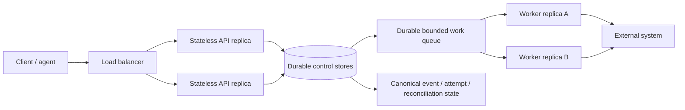
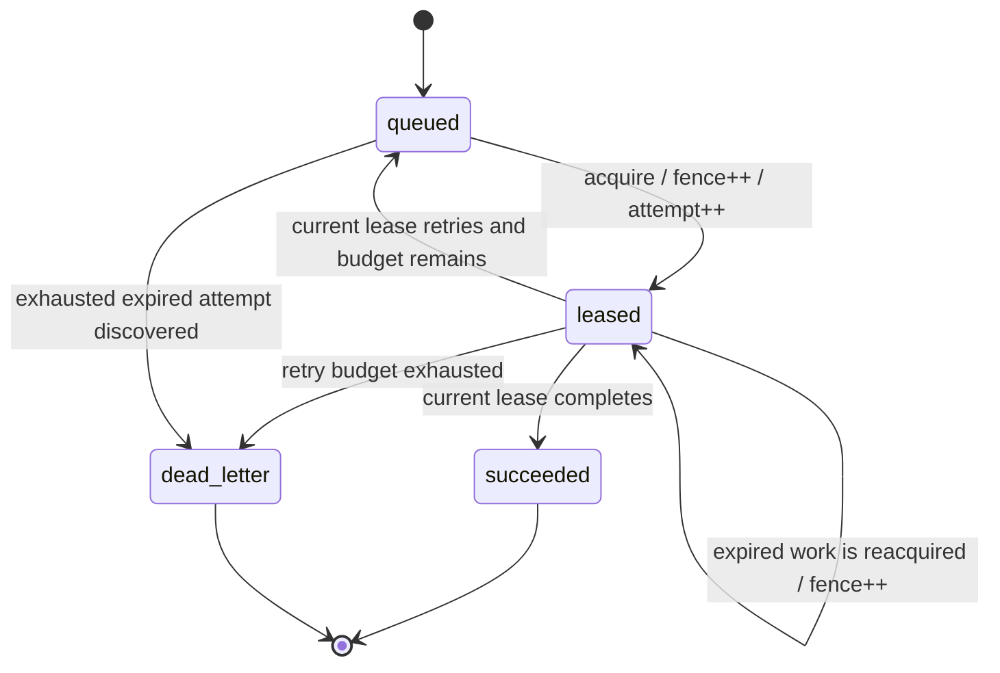

# High availability and scale

ProdKit Control v0.4.0 defines a horizontally scalable control-plane profile without weakening the safety rules that govern externally visible effects. API and worker processes may be replicated and replaced; durable ownership, work state, action idempotency, execution attempts, event history, and reconciliation remain outside any one process.

## Design goals

The HA profile is designed to provide all of the following together:

- stateless API replicas with shared durable stores;
- single-owner coordination through time-bounded leases;
- monotonic fencing so stale owners cannot mutate shared scheduler state;
- bounded durable work admission and explicit overload behavior;
- recoverable scheduling after process or host loss;
- tenant-aware and global concurrency limits;
- graceful draining for shutdown and rolling replacement;
- a standalone in-memory implementation with the same public contracts;
- no architectural dependency on Kubernetes, Redis, Temporal, or any commercial scheduler;
- fail-closed treatment of uncertain external effects.

## Control-plane topology

A production deployment may replace PostgreSQL-backed scheduling with another implementation of the canonical `LeaseStore` and `DurableWorkQueue` ports, provided it preserves the same ownership, fencing, idempotency, retry, and overload semantics.

## Fenced ownership

`FencedLease` identifies one `(tenant_id, resource_key)` owner for a bounded time and carries a monotonically increasing `fence_token`.

Acquisition rules are deliberately strict:

1. only one unexpired owner exists for a resource;
2. a competing owner receives no lease while the current lease is valid;
3. takeover after expiry or release issues a strictly larger fencing token;
4. renewal, release, completion, and retry require the current lease identity and fence token;
5. stale or expired owners fail with `LeaseLostError`;
6. releasing a lease does not reset the fencing sequence.

The PostgreSQL implementation uses the database clock for expiry decisions and serializes generic lease acquisition transactionally. Durable queue workers use row locking with `SKIP LOCKED` so independent replicas can claim different work without a process-local coordinator.

## External-effect safety boundary

A scheduler fence is not, by itself, an exactly-once guarantee for arbitrary external APIs.

ProdKit therefore separates two kinds of ownership:

- **action idempotency ownership** is durable and is not automatically expired for replay. If a worker may have caused an external effect and the outcome is unknown, the `ActionBroker` keeps the action owned and records an uncertain attempt until reconciliation resolves it;
- **scheduler ownership** is time-bounded and recoverable. It is appropriate for reconciliation, polling, projection, compaction, delivery, and other work whose handler is replay-safe.

A durable-work handler that can create an external effect must satisfy at least one of these conditions before automatic replay is safe:

- the provider enforces the stable ProdKit idempotency key;
- the destination accepts and rejects stale fencing/version tokens;
- the operation is otherwise proven idempotent by contract.

If none applies, the handler must fail closed and route an ambiguous result into the existing execution-attempt/reconciliation path. v0.4.0 does **not** claim that lease expiry makes an arbitrary side effect safe to repeat.

## Durable work state machine

`DurableWorkItem` is idempotently admitted by `(tenant_id, queue, idempotency_key)`. Reusing that identity for a different kind or payload is rejected. Queue admission is bounded; saturation raises `QueueOverloadedError` instead of accepting unbounded memory/database growth.

## Backpressure and fairness

The runtime exposes `CapacityAdmissionController` for immediate fail-fast admission. It enforces both a global in-flight ceiling and a per-tenant ceiling. This prevents one tenant from consuming the entire replica-local execution budget and makes overload visible to callers instead of turning it into unbounded latency.

Production HTTP/gRPC adapters should map capacity and draining errors to retryable overload responses with bounded client retry/backoff. Durable queues should be partitioned or sharded when one queue approaches its qualified envelope rather than silently raising the configured limit.

## Graceful shutdown and rolling upgrades

`RuntimeLifecycle` has three states: `accepting`, `draining`, and `stopped`.

A terminating replica must:

1. enter `draining` and fail readiness;
2. reject new admitted control work;
3. allow already admitted requests/jobs to finish within the configured grace period;
4. stop after the in-flight count reaches zero or the deployment grace period expires;
5. never acknowledge durable work after losing its lease during a prolonged shutdown.

The v0.4 PostgreSQL migration is additive. For a rolling upgrade, apply the additive schema migration first while existing v0.3 replicas remain running, start v0.4 replicas, require v0.4 readiness, then drain and replace old replicas. Existing v0.3 processes do not depend on the new tables. A v0.3 process restarted after schema metadata advances may fail its startup compatibility check by design; that is preferable to running an unknown schema silently.

## PostgreSQL HA profile

Production deployments should use a PostgreSQL service with synchronous or provider-documented durable replication appropriate to the organization's RPO/RTO, automated failover, backups with restore testing, connection-pool limits, statement/lock timeouts, and monitoring for replication lag and transaction saturation.

The database remains authoritative for durable leases and queue state. Application clocks are not used to decide PostgreSQL lease expiry. Operators must still ensure normal host time synchronization because event timestamps, provider credentials, signatures, and external integrations depend on reasonable wall-clock accuracy.

A database failover can abort an in-flight transaction. Callers must retry the **database transaction** only when no external effect has escaped it. An uncertain external effect must use the action reconciliation path rather than being inferred from a lost database connection.

## Standalone profile

`InMemoryLeaseStore`, `InMemoryDurableWorkQueue`, `RuntimeLifecycle`, and `CapacityAdmissionController` implement the same contracts without external infrastructure. This profile supports local tools, tests, single-process deployments, and embedded use. It does not claim durability across process loss; production HA requires a durable store implementation.

## Invariants

1. No two current leases for one tenant/resource may both be authoritative.
2. A higher fencing token permanently supersedes every lower token for that resource generation.
3. Queue admission is bounded and overload is explicit.
4. Retry count is bounded and exhausted work is dead-lettered.
5. A stale worker cannot complete or retry durable work.
6. Process replacement does not own canonical state.
7. Action idempotency is not converted into an expiring replay lease.
8. Unknown external-effect outcomes remain uncertain until reconciled.
9. Standalone mode remains available without a hosted coordinator.
10. Scale claims are limited to the published and tested capacity envelope.
