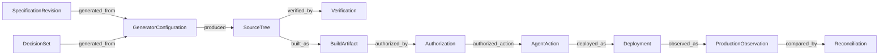
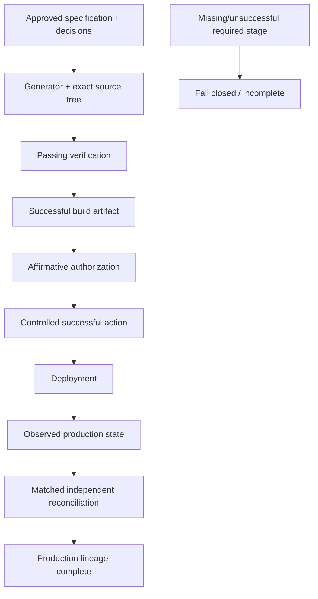
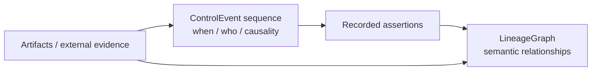
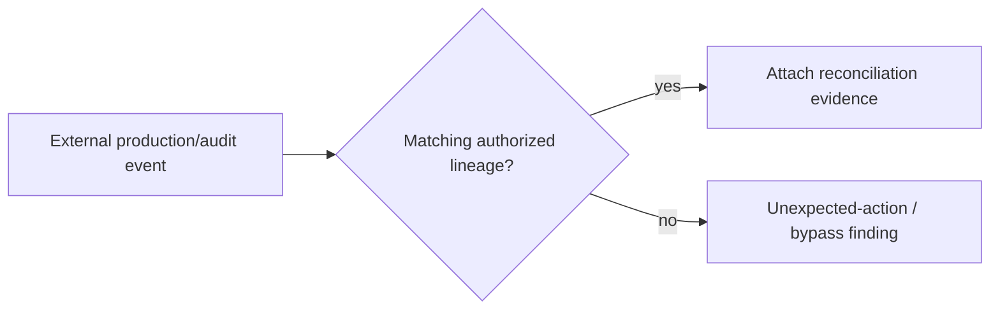

# Product lineage model

## Principle

Code may be disposable as an implementation, but it cannot be anonymous as evidence. ProdKit Control therefore treats an exact source tree, verification result, build artifact, authorization, action, deployment, production observation, and reconciliation as durable product/control identities even when their underlying implementations are later regenerated or discarded.

The lineage model answers: **which exact approved intent led to which exact observed production state, through which verified and authorized stages?**

## Canonical graph

`LineageGraph` is scoped to one tenant and run. Every node carries:

- stable UUID identity;
- SHA-256 content identity;
- tenant/run ownership;
- recording time;
- stage-specific typed payload;
- optional evidence/artifact references;
- schema/version information required to validate the node.

## Supported node kinds

The canonical foundation includes these semantic stages:

- specification revision;
- decision set;
- generator configuration and inputs;
- source tree;
- verification result;
- build artifact;
- authorization;
- agent action;
- deployment;
- production observation;
- reconciliation.

Future node kinds may be added through versioned contracts, but existing semantics must not be silently redefined.

## Typed relations

Relations are typed subject-predicate-object assertions. Endpoint constraints prevent nonsensical or malicious graph substitutions.

Examples:

- `GeneratorConfiguration generated_from SpecificationRevision`;
- `GeneratorConfiguration produced SourceTree`;
- `SourceTree verified_by Verification`;
- `SourceTree built_as BuildArtifact`;
- `BuildArtifact authorized_by Authorization`;
- `Authorization authorized_action AgentAction`;
- `AgentAction deployed_as Deployment`;
- `Deployment observed_as ProductionObservation`;
- `ProductionObservation compared_by Reconciliation`.

Relation references repeat endpoint kind, UUID, and digest so stale or substituted identities fail validation.

Graph validation rejects, at minimum:

- missing endpoints;
- duplicate identities;
- duplicate relations;
- invalid endpoint kinds for a relation;
- digest/identity disagreement;
- cross-run or cross-tenant references;
- prohibited cycles.

## Why both UUID and content digest exist

A UUID identifies the record instance; a content digest identifies the canonical content. Keeping both allows the system to detect accidental or malicious substitution while still supporting references to a stable record identity.

Two nodes may represent equivalent content in different contexts only when the schema permits it; the runtime must not assume matching content hashes erase tenant/run/context boundaries.

## Production completeness

`ProductionLineagePolicy` determines whether an observed production state has the required continuous lineage for the active assurance profile.

The reference production completeness assessment requires a continuous graph containing:

1. approved specification revision and decision set;
2. successful generator configuration and exact source tree;
3. passing verification against content-addressed requirements/results;
4. successful build artifact;
5. affirmative authorization bound to policy, approval, and action-set digests;
6. successful controlled agent action and deployment;
7. observed production-state digest;
8. matched independent reconciliation.

Assessment returns both satisfied and missing requirements. Enforcement raises `IncompleteLineageError` when a required stage is absent or unsuccessful.

Organizations may define stricter profiles against the same canonical graph; for example, a high-risk production profile might additionally require signed provenance, two-person approval, a specific reconciler set, or a trusted checkpoint.

## Lineage versus event history

The same durable lineage relationship can be introduced, corrected, or reconciled through multiple ordered events. The graph is the semantic view; the event chain preserves how that view came to be.

## Ownership boundary

ProdKit Control does not need to author specifications, generate code, run CI, build artifacts, deploy software, or operate observability backends. Those systems remain authoritative for their own operations.

ProdKit Control owns:

- canonical identity/linkage between stages;
- controlled action authorization semantics;
- integrity validation;
- evidence references;
- completeness assessment;
- reconciliation into a portable control record.

Git is therefore one witness in the chain, not the canonical explanation of the running system. Agent reasoning can be retained as optional evidence, but proposals, decisions, actions, effects, and typed relationships are the required evidence model.

## Evidence strength

Not all lineage nodes have the same evidence strength. A node asserted only by the same component that performed the effect is weaker than a node corroborated by an independent external source.

A production profile should be explicit about required evidence, for example:

- source tree digest derived from exact repository tree;
- verification result from CI/test evidence;
- build artifact digest from registry/build system;
- deployment identity from deployment platform;
- production observation from target read path;
- reconciliation from external audit/control-plane records.

The graph records the semantic relationship; guarantee strength depends on the evidence and trust policy behind those assertions.

## Bypass detection

A complete internal lineage cannot prove organization-wide completeness when production changes can bypass the broker. External reconciliation is required to detect activity with no corresponding authorized lineage.

The system should not synthesize an authorization after the fact merely to make an unexplained external action fit the graph.

## Corrections and supersession

Incorrect lineage assertions are not silently mutated away. A correction is recorded through new events/evidence and projectors may mark an assertion superseded or ineffective while retaining historical provenance.

If the original action/effect actually occurred, a later corrective or rollback action becomes a new lineage branch/action, not a deletion of the original history.

## Portability

Evidence bundles should carry enough node, relation, schema, digest, event, and artifact-reference information for an independent verifier to validate the exported lineage against a trusted archive/checkpoint digest without requiring access to the originating model vendor.

## Schema evolution

Lineage schema evolution should preserve these rules:

- explicit node/relation versions;
- no silent reinterpretation of an existing version;
- reject unsupported security-critical semantics rather than guess;
- migrations may build new projections but should not rewrite historical evidence;
- 1.0 publishes supported compatibility/migration policy.

## Current implementation boundary

`v0.0.0` contains the typed graph, endpoint-constrained relations, deterministic identities, production-lineage policy, evidence-bundle representation, and reference validation. Durable enterprise lineage persistence, full external reconciler coverage, organization-specific assurance profiles, and signed interoperability gates remain roadmap work.
