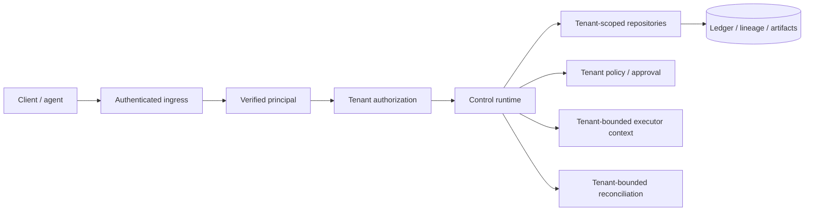
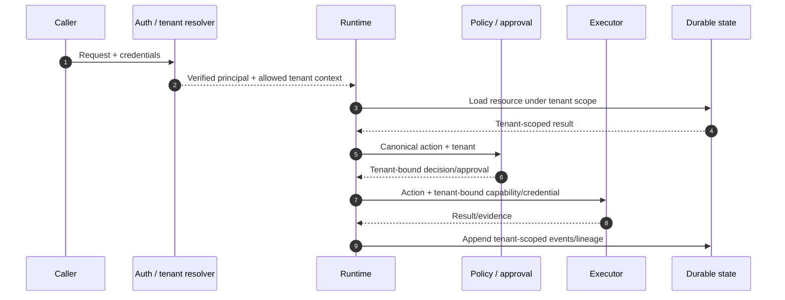

# Multi-tenancy and isolation

Tenant isolation is an architectural property, not a UI convention. A production multi-tenant deployment must prevent one tenant from reading, mutating, authorizing, executing against, reconciling, or exporting another tenant's control/evidence data except through explicit, audited administrative mechanisms.

## Tenant trust model



The production tenant identity used by the runtime must originate from a verified identity/authorization context. A request field such as `tenant_id` can help route/validate a request, but it cannot be the source of authority by itself.

## Isolation dimensions

### Identity isolation

Every authenticated actor/service principal should have an explicit relationship to the tenant(s) it can access. Service-to-service identity should be verified independently of untrusted caller fields.

### Authorization isolation

Authorization must cover both the tenant and the resource/action. Possessing a valid identity for tenant A must not grant access to tenant B even when a global resource UUID is guessed.

### Storage isolation

Tenant identity should be represented in every durable canonical record needed to enforce isolation. Repository/query APIs should make tenant scoping difficult to omit accidentally.

Possible deployment strategies include:

- shared database + tenant-keyed rows with mandatory predicates and database protections;
- schema-per-tenant;
- database-per-tenant;
- environment/account isolation for selected high-assurance tenants.

The architecture does not mandate one universal strategy, but the supported production profile must document which strategy it verifies.

### Artifact isolation

Artifact paths/object keys, encryption context, retention policy, export, and deletion must respect tenant boundaries. A globally deduplicated content hash must not by itself become a cross-tenant read capability.

### Cache isolation

Cache keys must include authoritative tenant scope where cached data is tenant-specific. Negative caching, authorization caching, compiled policy caching, and artifact metadata caches must be reviewed for cross-tenant leakage.

### Task/workflow isolation

Queued jobs, workflow histories, leases, timers, and reconciliation cursors must carry tenant identity. A worker may service multiple tenants, but every task must re-establish authorized tenant context rather than inherit mutable process-global state.

### Policy and approval isolation

Policy bundle/revision identity and human approval must be associated with the correct tenant/organization context. An approval from tenant A cannot satisfy an action for tenant B even if action arguments are otherwise identical.

### Executor isolation

Executor credentials/capabilities must be scoped to the tenant/environment/target they are authorized to affect. Long-lived shared superuser credentials undermine tenant isolation and make action-level policy less meaningful.

### Reconciliation isolation

Reconcilers must query external evidence using identities/credentials that cannot cause cross-tenant evidence to be silently attached to the wrong run/action. External identity mapping is part of the isolation boundary.

### Telemetry isolation

Operational telemetry may be aggregated across tenants for operators, but tenant-sensitive attributes/content must follow access and retention policy. Customer-facing telemetry must remain scoped.

## Tenant-scoped canonical identity

Canonical objects should treat tenant identity as part of their validation context. A globally unique UUID does not remove the need to validate tenant ownership.

Recommended rule:

```text
(resource_id is known) AND (resource.tenant_id == authenticated_principal.tenant_id)
```

before the resource participates in authorization or mutation, subject to explicit audited administrative roles.

## Administrative access

Enterprise operations sometimes require cross-tenant support/security access. That path should be exceptional and controlled with:

- explicit operator identity;
- narrowly scoped role/capability;
- reason/ticket/reference;
- time-bounded elevation where practical;
- full audit event;
- customer/organization policy where required;
- no reuse of customer credentials;
- post-access review for high-risk operations.

“Platform admin” must not be implemented as silently disabling tenant predicates across ordinary code paths.

## Tenant-aware action flow



## Cross-tenant references

The default architecture prohibits cross-tenant lineage/action references. If a future use case requires explicitly shared/federated evidence, it should use a dedicated cross-tenant/federation contract with both sides' authorization and provenance rather than weakening ordinary tenant constraints.

## Data lifecycle

Tenant lifecycle operations should define:

- export scope and portable verification;
- retention after account closure;
- deletion scheduling and exceptions;
- legal-hold precedence;
- cryptographic erasure/key handling where used;
- preservation of evidence needed for contractual/security obligations;
- deletion of cached/projected copies;
- audit record of lifecycle actions.

## Isolation tests

The enterprise multi-tenant profile should include systematic negative tests for:

- run/event/lineage lookup by another tenant;
- action approval cross-use;
- idempotency-key collisions across tenants;
- artifact lookup/export;
- query filters and pagination cursors;
- task/workflow dispatch;
- executor credential scope;
- policy bundle selection;
- reconciliation identity mapping;
- cache key separation;
- administrator elevation/audit behavior.

Property/fuzz testing is valuable for repository/query boundaries because omission bugs frequently occur in combinations not covered by happy-path integration tests.

## Single-tenant deployments

A single-tenant deployment can simplify isolation but should still preserve explicit tenant/organization identity in canonical contracts where it is part of the data model. That keeps evidence portable and prevents a later multi-tenant migration from requiring ambiguous historical ownership reconstruction.

## Current implementation boundary

`v0.0.0` contains tenant-scoped contracts and a fail-closed principal-resolution boundary, but the complete enterprise multi-tenant isolation profile—including systematic cross-tenant verification, hardened production storage/task/executor isolation, and independent security review—is roadmap work.
