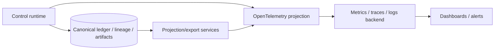
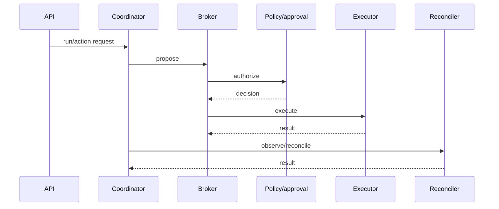

# Observability

Observability supports operations, diagnosis, capacity management, and service-level objectives. It is a **projection from canonical control activity**, not the canonical audit/evidence database.

This distinction matters because traces, logs, and metrics can be sampled, aggregated, dropped, redacted, delayed, or retained for less time than assurance evidence.

## Observability boundary



Operational systems may help investigate an incident, but an absent sampled trace must not mean the canonical action never happened.

## Correlation identities

Recommended correlations include:

- W3C trace ID and span ID;
- tenant and run ID;
- canonical event ID/sequence;
- action ID and action digest;
- policy decision and approval IDs;
- execution attempt ID;
- executor capability/instance identity;
- verification/reconciliation identity;
- provider request ID;
- external request/operation ID;
- CI workflow/build ID;
- deployment/revision ID;
- cloud request ID;
- database transaction/audit ID;
- Kubernetes UID/resourceVersion/audit identity.

Canonical IDs should be included as low-cardinality-safe references where practical, but telemetry design must respect backend cardinality limits.

## Trace model

A typical trace can represent the runtime path:



The trace is useful for latency and error diagnosis. The canonical event sequence remains authoritative for assurance semantics.

## Metrics

A production profile should expose metrics in several groups.

### Request/control-plane health

- request rate, latency, and error rate;
- authentication/authorization failures;
- database/object-store latency/errors;
- queue/orchestration backlog;
- worker availability and saturation.

### Action lifecycle

- proposed actions by risk/effect class;
- policy deny/allow/approval-required counts;
- approval wait time and expiry;
- execution start/success/failure/uncertain counts;
- idempotency conflicts;
- action age by lifecycle state;
- executor latency and target error classification.

### Assurance/reconciliation

- observations pending;
- reconciliation lag/freshness;
- matched/mismatched/unverifiable results;
- unexpected external/bypass actions;
- incomplete production lineage assessments;
- integrity verification failures;
- checkpoint/export failures.

### Storage/lifecycle

- ledger write latency and sequence conflicts;
- artifact write/read failures;
- retention/export/delete/hold failures;
- backup/restore verification where operationally exposed.

## Suggested SLO families

Exact SLO values belong to a supported production profile and should be set after capacity testing. Useful SLO families include:

- API/control-plane availability;
- authorization decision availability/latency;
- durable event persistence latency;
- executor dispatch latency;
- reconciliation freshness;
- maximum age of unresolved uncertain actions;
- evidence export/checkpoint success;
- restore/recovery objectives.

A strict assurance profile may prefer **failing closed** over meeting availability when policy, canonical durability, or required evidence systems are unavailable. Availability SLOs must not encourage bypassing assurance controls.

## Alert classes

High-severity examples:

- integrity/checkpoint verification failure;
- unexpected production action with no authorized ProdKit lineage;
- cross-tenant authorization anomaly;
- repeated executor uncertainty above threshold;
- reconciliation mismatch for high-risk production target;
- direct credential/broker-bypass detection;
- inability to durably persist required canonical events;
- signing/trust-root failure in a profile that requires signing.

Medium/operational examples:

- growing reconciliation lag;
- approval backlog;
- worker saturation;
- elevated provider/target errors;
- artifact-store latency;
- repeated stale policy/approval decisions.

## Logging

Structured logs should include canonical correlation identifiers without copying unrestricted canonical payloads.

Do not place these in normal logs/span attributes:

- raw credentials or tokens;
- secret values;
- unrestricted prompts/results when they may contain sensitive data;
- unredacted personal/sensitive content;
- encryption/signing private material;
- full database query parameters when sensitive.

Use artifact references/digests and controlled retention paths for content that must be preserved.

## Sampling

Tracing/log sampling is acceptable for operations. Canonical event recording required by the active assurance profile is **not sampled**.

Errors, uncertain outcomes, integrity failures, policy denials, reconciliation mismatches, and security findings should generally receive elevated telemetry retention/sampling priority, but telemetry still remains secondary evidence.

## Cardinality

Avoid unbounded metric labels such as full prompt text, arbitrary URLs, action arguments, artifact digests, raw user IDs, or provider response bodies. Use traces/logs or canonical references for high-cardinality identifiers.

Tenant labels may also be high cardinality or sensitive; deployment-specific policy should govern whether they appear in shared metrics.

## OpenTelemetry semantics

The architecture is OpenTelemetry-compatible rather than tied to one backend. Semantic conventions should be versioned where custom ProdKit attributes are introduced.

Recommended attribute namespace examples:

```text
prodkit.tenant.id
prodkit.run.id
prodkit.event.id
prodkit.action.id
prodkit.action.risk_class
prodkit.policy.decision_id
prodkit.approval.id
prodkit.execution.attempt_id
prodkit.executor.capability
prodkit.reconciliation.status
```

Attribute names are illustrative until formalized as stable semantic contracts; package/schema versions should make compatibility explicit.

## Dashboards

A useful production dashboard should separate:

- **service health** — is the control plane working?
- **execution health** — are authorized effects succeeding safely?
- **assurance health** — are observations/reconciliation/integrity complete?
- **security health** — are bypass, tenant, policy, or credential anomalies occurring?

A green API dashboard with stale reconciliation is not a green assurance system.

## Current implementation boundary

`v0.0.1` provides OpenTelemetry-compatible correlation/adapter boundaries and canonical identities suitable for projection. Formal production SLOs, complete dashboards/alerts, scale envelopes, and enterprise operational validation are roadmap-gated.
