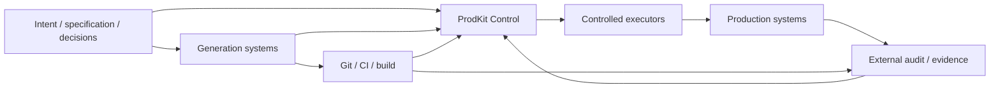
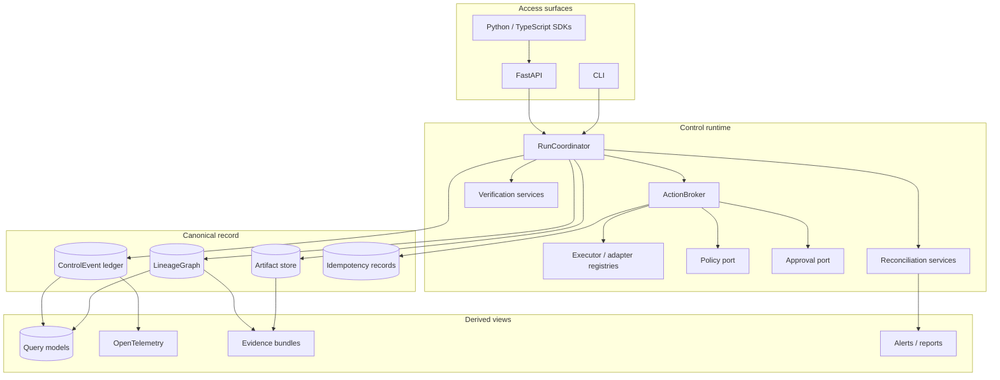
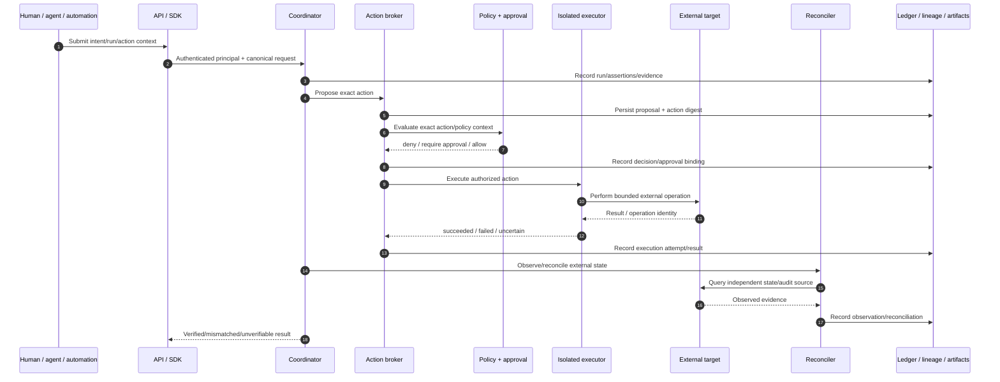
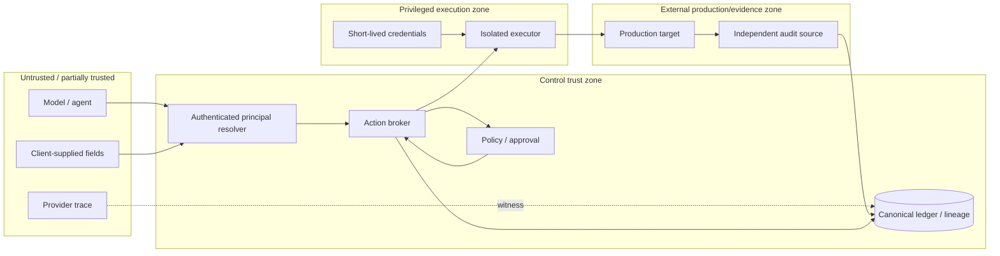

# Architecture overview

This document is the canonical architecture entry point for ProdKit Control. It defines the system objective, ownership boundaries, architecture layers, trust zones, canonical data, failure model, deployment profiles, and invariants that implementation work must preserve.

## Design objective

ProdKit Control records and controls a provider-independent, content-addressed lineage from approved intent to independently observed production state.

It is **not**:

- a wrapper around one model vendor;
- a specification-authoring system;
- a replacement for Git, CI, build systems, deployment platforms, databases, or observability backends;
- a system that treats model-generated tool calls as trusted facts;
- a guarantee of organizational completeness when humans or agents can bypass the controlled path.

Its core job is to answer, with independently verifiable evidence: **what was intended, what exact change was produced, what authorized it, what executed, what changed, what production state was observed, and whether external systems agree.**

## Architectural position

ProdKit can observe and link systems it does not own. Ownership remains with the system responsible for the operation; ProdKit owns the **canonical control/evidence relationships** between those operations.

## Architecture layers

1. **Intent** — immutable specification revisions, constraints, decision sets, and policy context.
2. **Generation** — generator identity, version, model/provider metadata, canonical inputs, and exact source-tree digest.
3. **Verification and build** — requirements, tests/proofs, verification results, builder identity, and artifact digest.
4. **Action control** — proposal persistence, policy evaluation, exact approval, expiry, risk classification, idempotency, and controlled execution authorization.
5. **Execution** — isolated executors acting with explicit capabilities and deployment-supplied short-lived workload identity.
6. **Deployment and observation** — deployment identity, target identity, before/after evidence, and independently observed production-state digest.
7. **Reconciliation** — comparison with Git, CI, registry, cloud, database, Kubernetes, deployment, and other external evidence sources.
8. **Integrity** — typed lineage, append-only events, deterministic hashing, content-addressed artifacts, signed checkpoints, and evidence bundles.
9. **Projection** — APIs, query models, OpenTelemetry, dashboards, alerts, reports, exports, and other non-canonical read models.

## Logical component model

The precise class/package implementation may evolve. The responsibility boundaries must remain explicit: access surfaces do not become authorization authorities; projections do not become canonical history; provider adapters do not become executors; executor implementations do not become approval authorities.

## Source of truth

The canonical record is composed of:

- the typed `LineageGraph` for semantic product relationships;
- the append-only `ControlEvent` sequence for ordered assertions/actions and causality;
- content-addressed artifacts for exact retained inputs/outputs/evidence;
- durable idempotency/execution records where external side effects are possible;
- externally trusted anchors/checkpoints where the selected assurance profile requires tamper resistance against administrative replacement.

Provider logs, Git history, database query tables, traces, dashboards, and external audit logs are witnesses or projections. They may corroborate or contradict the canonical record; they cannot silently replace it.

## End-to-end control flow

An `execution.uncertain` result is intentionally distinct from failure. If an external effect might have occurred, ProdKit retains the idempotency claim and requires observation/reconciliation before deciding whether retry is safe.

## Trust boundaries

### Trust rules

- Models and agents are untrusted proposers.
- Client-provided tenant/actor identifiers are not production authentication.
- Policy and approval decisions are trusted only within their documented identity/version/signature boundary.
- Executors are privileged components and must be isolated from untrusted code where production credentials exist.
- External systems can be compromised or incomplete; reconciliation should use independent evidence when practical.
- A single database hash chain is not sufficient against an administrator able to replace both history and anchors; higher assurance profiles require externally trusted anchors/checkpoints.

## Canonical invariants

Implementation changes must preserve these invariants unless an architecture decision explicitly supersedes them:

1. **Model proposals never imply authority.**
2. **Production authorization binds exact content and context.**
3. **Every routed external side effect has a durable execution identity.**
4. **Uncertain outcomes are reconciled before unsafe retry.**
5. **Historical events are append-only; corrections are new events.**
6. **Lineage edges are typed and endpoint-constrained.**
7. **Tenant identity originates from authenticated context in production.**
8. **Canonical evidence is not dependent on sampled telemetry.**
9. **Provider/vendor adapters cannot weaken core authorization semantics.**
10. **Missing required evidence fails closed for the assurance profile that requires it.**
11. **Bypass activity is a finding, not an invisible success path.**
12. **A package boundary does not imply production maturity.**

## Failure model

The control path fails closed on, at minimum:

- missing/invalid policy decision;
- invalid, expired, stale, or mismatched approval;
- unknown or unauthorized executor capability;
- tenant mismatch or unauthorized resource access;
- idempotency conflict;
- integrity/hash/signature failure;
- invalid lineage relation;
- incomplete required production lineage;
- required reconciliation that is mismatched or unavailable under a strict profile.

The system distinguishes ordinary execution failure from ambiguous side effects. See [Failure and recovery](failure-recovery.md).

## Deployment profiles

Architecture is described in profiles so “standalone,” “production-ready,” and “enterprise” have precise meanings.

### Development/reference profile

For local evaluation and tests. May use in-memory stores and explicitly enabled insecure development authentication. It must never be presented as a hardened production profile.

### Standalone durable profile

Runs the ProdKit Control semantics without another ProdKit product. Uses durable storage, authenticated principals, and explicit adapter configuration. External infrastructure such as PostgreSQL or object storage does not violate standalone capability.

### Production control profile

Adds isolated executors, short-lived workload identity, production policy/approval integration, durable idempotency, independent observation/reconciliation, encrypted artifact retention, and operational controls.

### Enterprise assurance profile

Adds documented HA/capacity, DR, tenant-isolation verification, retention/legal hold, key rotation/trust policy, compatibility/migrations, SLOs, security operations, and independent review.

See [Deployment architecture](deployment.md) and [ROADMAP.md](../../ROADMAP.md).

## Standalone and integration boundaries

The core must remain usable without requiring a specific:

- model provider;
- cloud provider;
- Git host;
- policy engine;
- workflow engine;
- telemetry backend;
- sandbox vendor;
- privileged-access vendor;
- signing service.

Adapters may offer first-class integrations, but canonical contracts and guarantee semantics remain vendor-neutral. See [Extension architecture](extensions.md).

## Multi-tenancy

Tenant isolation is both a data-plane and control-plane property. Production tenant identity must be derived from authenticated context and enforced at repository, query, mutation, artifact, task, executor, policy, approval, and reconciliation boundaries. See [Multi-tenancy and isolation](multi-tenancy.md).

## Observability

OpenTelemetry spans, metrics, and logs are operational projections from canonical runtime activity. They support diagnosis and SLOs but are not the unsampled audit ledger. See [Observability](observability.md).

## Documentation precedence

When documents disagree, use this precedence and fix the inconsistency:

1. security-critical code/contracts and tests for the released implementation;
2. release notes for the exact released version boundary;
3. this architecture overview and the guarantee document for intended semantics;
4. specialized architecture/security/operations documents;
5. README summaries and examples;
6. roadmap items, which describe future gates rather than implemented capability.

Documentation must never upgrade a roadmap target into a present-tense guarantee without implementation evidence.
