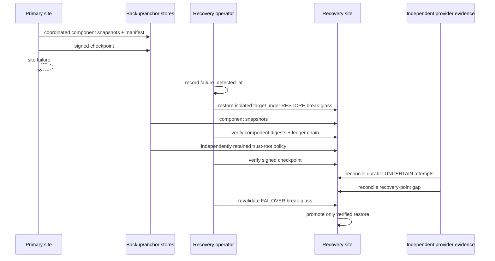

# Reliability and disaster recovery

## Scope

ProdKit Control v0.7.0 defines the reliability and disaster-recovery control boundary for the supported enterprise warm-standby profile. Recovery is an assurance operation, not merely a database restore: a site is promotable only when recovered control state, evidence integrity, independent trust anchors, uncertain execution, and the recovery-point gap have all been reconciled.

The qualified reference profile uses an RPO of **300 seconds** and an RTO of **3600 seconds**. These values describe the repository's exercised reference profile; they are not a universal SLA for every deployment. Operators may configure stricter values only when their infrastructure, backup cadence, provider evidence, and exercises demonstrate those targets.

## Recovery set

A canonical `BackupManifest` identifies one recovery point and one snapshot set. The enterprise profile requires recovery material for:

- event ledger;
- lineage;
- configuration;
- artifact metadata;
- object-store content;
- idempotency ownership;
- execution attempts;
- governance state.

Each component is immutable/content-addressed in the manifest and carries capture time, source site, digest, size, encryption and immutability metadata. A usable backup must satisfy the active `ReliabilityProfile`, include every required component, and remain within the configured backup-age and RPO bounds.

Backup components that cannot be captured atomically must use infrastructure-specific snapshot coordination so their declared `snapshot_set_id` represents one recoverable consistency boundary. ProdKit's manifest records that boundary; it does not make an inconsistent provider snapshot consistent after the fact.

## Independent assurance anchors

The backup manifest records three distinct assurance references:

1. the recovered ledger chain-tip digest;
2. the signed checkpoint digest;
3. the digest of the independently retained trust-root policy.

The trust-root policy is not recovered from, or trusted merely because it exists inside, the failed site's backup set. During restore, `RecoveryIntegrityVerifier` verifies the checkpoint signature using `OfflineAssuranceVerifier`, requires the checkpoint digest to equal the manifest's expected checkpoint, verifies the independently supplied trust-root policy digest, validates the ledger chain tip, and validates every restored component including object-store recovery.

A restore with a missing, mismatched, untrusted, revoked, or invalidly signed checkpoint is not verified.

## Failure and restore timeline

`failure_detected_at` is part of the restore plan. It bounds the period that may contain effects not present in the recovered snapshot.

## Uncertain execution and the RPO gap

Recovery has two uncertainty classes and both fail closed.

### Durable uncertain attempts

All tenant-owned execution attempts whose durable state is `UNCERTAIN` are enumerated from PostgreSQL. A caller cannot select a convenient subset. Every attempt must be reconciled to independent provider evidence. `MATCHED_SUCCESS` and `MATCHED_FAILURE` require an evidence reference; unresolved or unverifiable attempts prevent a verified restore. Recovery never changes the original terminal `UNCERTAIN` journal entry and never authorizes blind replay.

### Recovery-point gap

Even a complete restored execution-attempt table cannot prove what happened after `recovery_point_at` and before `failure_detected_at`. `RecoveryGapReconciliation` therefore records the independent sources used to inspect that window, any unexpected external effects, any unresolved effects, and a durable evidence reference.

Promotion requires exactly one append-only gap reconciliation for the restore, zero unresolved effects, and `blind_replay_permitted = false`. Unexpected effects may be discovered and still reconciled; unresolved effects block promotion.

## Break-glass authority

Emergency recovery authority is explicit, short lived and four-eyes:

- an ordinary tenant approver issues a grant to a different operator;
- capabilities are individually scoped (`RESTORE`, `INTEGRITY_SCAN`, `RECONCILE`, `FAILOVER`, or recovery configuration);
- every use is checked against tenant, operator identity, capability, revocation and expiry;
- PostgreSQL uses database time for live grant validation;
- support elevation is not recovery-governance authority;
- uses and revocations are append-only evidence.

Planning a restore consumes `RESTORE`; integrity verification consumes `INTEGRITY_SCAN`; uncertainty and gap reconciliation consume `RECONCILE`; final promotion separately consumes a live `FAILOVER` authorization. An expired or revoked grant between those stages blocks the next stage.

## Durable recovery catalog

PostgreSQL schema 8 adds tenant-scoped, append-only recovery evidence for reliability profiles, backup manifests, break-glass grants/uses/revocations, restore plans, integrity scans, uncertain-execution recoveries, RPO-gap reconciliation, restore results, game-day exercises and recovery audit events.

The migration is additive from schema 7 to schema 8 and preserves earlier run, execution, tenancy, governance, lineage and evidence state. Runtime startup remains fail closed when schema metadata is ahead or behind the expected version.

## Promotion invariant

A restore may be marked `VERIFIED` and promoted only when all of the following hold:

- actual RPO and RTO meet the active profile;
- every required restored component digest matches;
- the ledger chain tip matches the backup manifest;
- the exact backed-up signed checkpoint verifies cryptographically;
- the independently retained trust-root policy matches and trusts that checkpoint;
- object-store recovery verifies;
- every durable uncertain attempt is reconciled without blind replay;
- the recovery-point gap is reconciled with no unresolved effects;
- live `FAILOVER` break-glass authorization succeeds at promotion time.

Otherwise the result is degraded or failed and must not be promoted.

## Release qualification

The v0.7.0 PostgreSQL 18 qualification exercises schema 7 -> 8 migration, tenant isolation, append-only recovery evidence, real execution-attempt transitions, signed-checkpoint verification, RPO-gap reconciliation, break-glass revocation/capability checks, and a provider-neutral game day that restores bytes into an isolated target.

The game-day fixture is deterministic evidence that the reference software profile can satisfy the declared RPO/RTO under the exercised conditions. It is not evidence that an arbitrary production deployment has achieved those targets; production operators must run scheduled restore exercises and site-recovery game days against their own infrastructure.

## Claim boundaries

v0.7.0 implements and qualifies the repository's reliability/disaster-recovery engineering profile. It does not claim the broader v0.8 security/operational-hardening milestone, a universal availability SLA, or an external independent DR certification. The separate independent tenant-isolation review required for stronger v0.5 enterprise claim language remains a distinct assurance gate.
