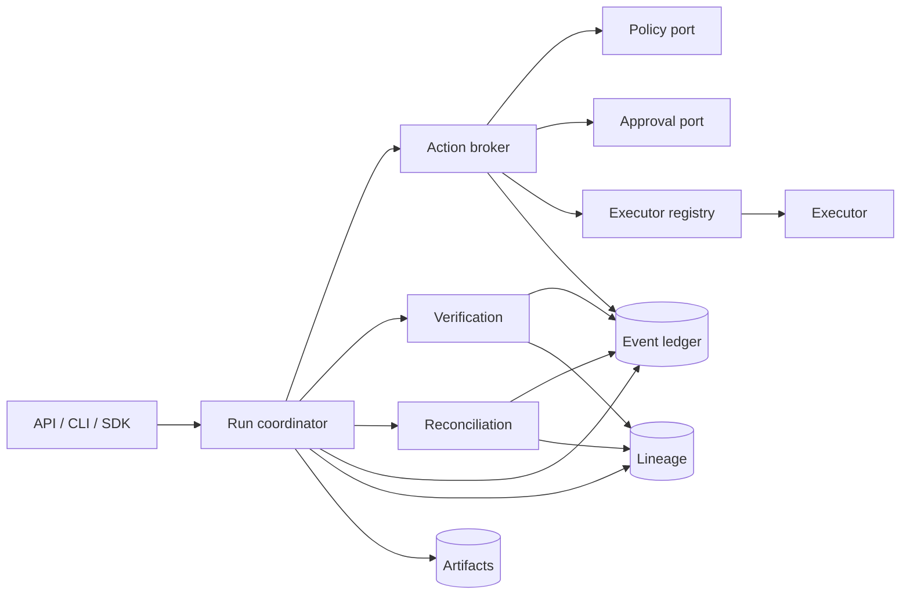
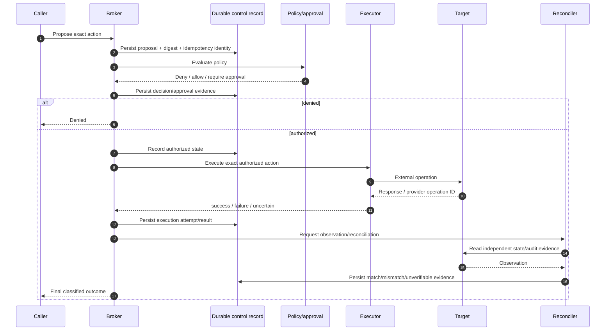
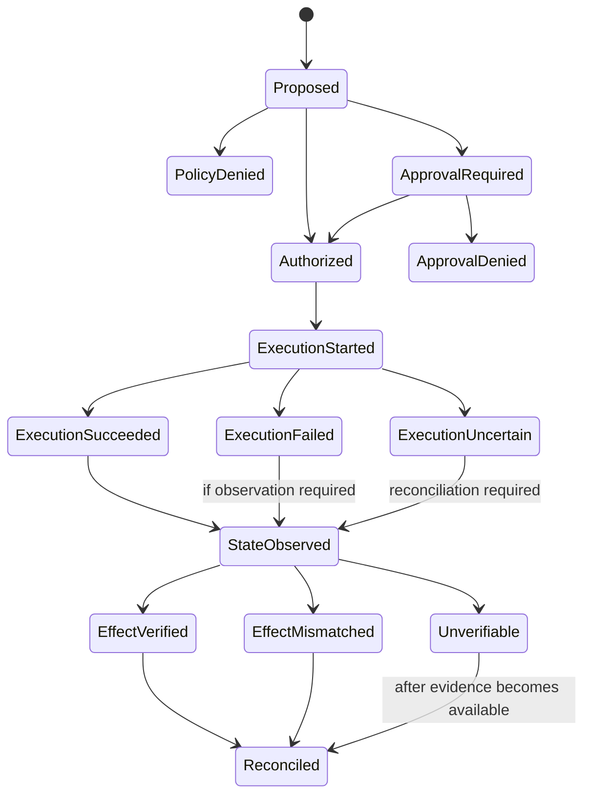

# Runtime and action flow

This document defines runtime responsibilities and the required ordering around externally visible actions. It describes the control semantics that production implementations must preserve even when orchestration, storage, executor, or provider adapters differ.

## Runtime responsibilities

### Access surfaces

API, CLI, and SDK layers translate caller requests into canonical contracts. In production they receive authenticated principal context from a trusted resolver. They must not infer authority from model identity, arbitrary headers, or caller-provided tenant/actor identifiers.

### Run coordinator

The coordinator manages run-level sequencing and composes services. It is responsible for ensuring that canonical assertions, verification, actions, observations, and reconciliation are attached to the correct tenant/run identities. It is not itself a policy authority or privileged executor.

### Action broker

The broker is the only supported path from an action proposal to a controlled external effect. It owns proposal persistence, policy/approval checks, expiry, idempotency ownership, executor selection, attempt recording, and result classification.

### Policy and approval ports

Policy answers whether the exact proposed action is denied, allowed, or requires approval. Approval records human/organizational authority and must bind to the exact action/context digest. Production implementations should authenticate policy/approval service identity and fail closed when required decisions are unavailable or unverifiable.

### Executor registry and executors

The registry maps explicit executor capabilities to implementations. Executors receive an already authorized action and only the credentials/capabilities needed for that operation. An executor is not allowed to reinterpret policy, expand the approved action, or mint its own approval.

### Verification and reconciliation

Verification proves properties about a known input/result inside the controlled workflow. Reconciliation compares the canonical record with independent external state/audit evidence. They are related but not interchangeable.

## Required action ordering

For a production profile, the proposal and authorization evidence must be durable **before** the privileged effect begins. The exact durability transaction design is implementation-specific, but the system must not rely on reconstructing approval after the side effect.

## Action state machine

An implementation may add internal states, but it must not collapse `ExecutionUncertain` into a safe-to-retry failure without reconciliation.

## Idempotency

Idempotency protects the system from duplicate external effects caused by retries, duplicated delivery, caller uncertainty, or control-plane failover.

A production idempotency record should bind at least:

- tenant and run identity;
- canonical action digest;
- idempotency key;
- target identity;
- executor capability/implementation identity;
- execution-attempt ownership/state;
- provider/external operation identity when available;
- final or uncertain outcome.

Reusing the same idempotency key for a different action digest is a conflict, not a retry.

## Crash boundaries

The runtime must be tested around these boundaries:

1. before proposal persistence;
2. after proposal persistence but before policy decision;
3. after approval but before execution starts;
4. after marking execution started but before the executor calls the target;
5. during a target operation;
6. after the target accepts the operation but before the response is persisted;
7. after execution result persistence but before observation;
8. during reconciliation;
9. after canonical state changes but before a caller receives the response.

Recovery must be derived from durable state and independent evidence, not from process memory.

## Before/after evidence

Where meaningful and permitted by the target system, an executor/reconciler should capture:

- target identity and pre-state fingerprint;
- expected effect;
- external operation/request identity;
- post-state fingerprint;
- independent audit record identity;
- verification or reconciliation result.

The exact evidence can vary by executor. A database change, Git operation, Kubernetes deployment, and HTTP action do not share identical evidence, but all must preserve the canonical action identity and result classification.

## Authorization freshness

Authorization must be re-evaluated or invalidated when any bound input changes, including action arguments, artifact identity, target/base state, environment, tenant, policy revision, approval expiry, or any configured risk-relevant context.

## Cancellation

Cancellation is best-effort after privileged execution begins. The runtime must distinguish:

- cancellation before authorization;
- cancellation after authorization but before execution;
- cancellation while an external request may be in flight;
- cancellation after an effect has occurred.

A cancelled caller request does not prove the external effect was cancelled. In-flight cancellation can therefore lead to an uncertain outcome requiring reconciliation.

## Retry policy

Automatic retry is appropriate only when the operation and durable state prove it is safe. Production retry rules should consider:

- whether the executor/target provides native idempotency;
- whether the idempotency record is owned and compatible;
- whether an external operation ID already exists;
- whether the previous attempt is known failed versus uncertain;
- whether target preconditions still match;
- whether authorization/approval remains fresh.

Non-idempotent uncertain actions require observation and often human decision before retry or rollback.

## Orchestration boundary

ProdKit Control may use Temporal or another workflow engine for durable orchestration, but orchestration history is not the canonical assurance record. Workflow engines schedule/recover work; `ControlEvent`, lineage, artifacts, idempotency, and trusted anchors carry the portable control/evidence semantics.

## Current implementation boundary

`v0.0.1` provides the canonical contracts, reference coordinator/broker behavior, in-memory ledger, evidence bundle model, API/CLI surfaces, and adapter boundaries. The hardened durable execution semantics in this document define the target production profile and are gated in the roadmap where not yet implemented.
