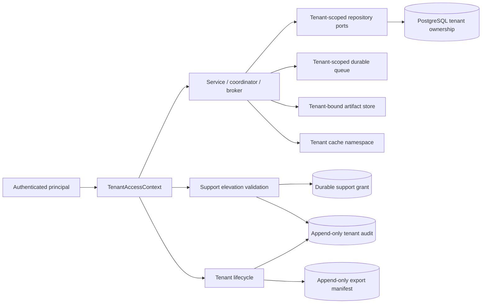

# Tenant isolation architecture

ProdKit Control treats tenant identity as part of authorization and persistence identity rather than metadata attached after lookup.

The ordinary path requires actor tenant identity to equal the target tenant. The support path is separate: a tenant opts in, a trusted support authority issues a short-lived exact-capability grant to a trusted operator, and every privileged operation revalidates that durable grant. Omitting tenant scope is not an administrative shortcut.

The durable profile adds database enforcement beneath service predicates. Composite tenant/identity relationships prevent an event, lineage node, execution attempt, or reconciliation record from being associated with a run/result owned by a different tenant. Mutable tenant-owned rows reject tenant reassignment. Audit and export evidence are append-only.

Tenant isolation configuration is itself tenant-local and selects policy, signing, retention, executor, storage, and cache profiles. Provider adapters remain responsible for applying equivalent tenant scope to external systems; shared-provider credentials or resources must not weaken the control-plane boundary.
