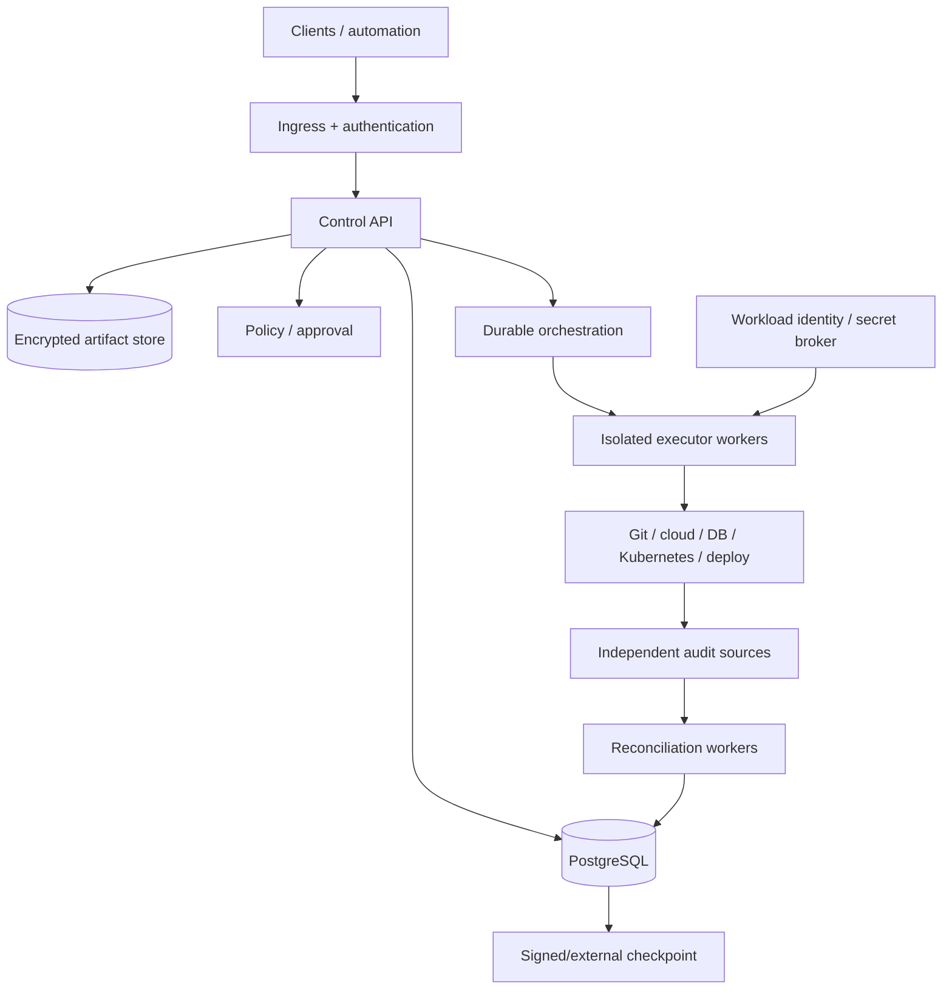

# Secure deployment

This guide defines minimum security requirements for deploying ProdKit Control beyond local development. It complements [Deployment architecture](../architecture/deployment.md) and the [Threat model](threat-model.md).

The included in-memory application and insecure header principal resolver are for development/reference use. They are **not** a production authentication/storage profile.

## Deployment rule

A production deployment should be able to answer all of these before enabling privileged actions:

- Which component authenticates the caller?
- How is tenant identity derived and authorized?
- Where is the canonical ledger durably stored?
- Where are artifacts/evidence stored and encrypted?
- Which policy revision authorizes an action?
- Which authenticated human/service approval identity is trusted?
- Which isolated executor can perform each capability?
- How are short-lived credentials issued and scoped?
- How is an uncertain side effect reconciled?
- Which external evidence detects broker bypass?
- Which trusted anchor detects canonical-history replacement?
- How are backup, restore, DR, retention, deletion, legal hold, and key rotation operated?

If these questions do not have explicit answers, the deployment should not claim the corresponding assurance level.

## Reference-to-production transition

## Required production controls

### 1. Durable canonical storage

Replace in-memory canonical stores with production-grade durable persistence. At minimum:

- durable append-only event semantics;
- durable idempotency/execution-attempt state;
- durable lineage/query state as required by the implementation;
- migrations with controlled rollout;
- encryption at rest/in transit;
- backup/restore procedures;
- database credentials scoped to service responsibilities.

A production effect must not depend on transient process memory being available after restart.

### 2. Authenticated principals

Replace development header authentication with a verified production `PrincipalResolver` or equivalent trusted identity boundary.

Humans should normally authenticate through OIDC/SSO or another enterprise identity provider. Services should use workload/service identity.

The runtime must not trust arbitrary client-supplied actor or tenant IDs as proof of authority.

### 3. Tenant authorization

Authorize tenant access outside untrusted client fields and enforce tenant scope across:

- run/action/event/lineage repositories;
- artifacts and exports;
- policy/approval lookup;
- queues/workflows/background tasks;
- executor credential selection;
- reconciliation mappings;
- caches and administrative tools.

See [Multi-tenancy and isolation](../architecture/multi-tenancy.md).

### 4. Executor isolation

Run production executors in isolated workers/processes/environments separate from untrusted model/agent code.

Prefer capability-specific executors over a single unconstrained privileged shell. Use allowlists/preconditions for high-risk operations where practical.

### 5. Workload credentials

Executors should receive short-lived, least-privilege credentials scoped to the target/environment/action class. Avoid long-lived shared production tokens.

Agents/models should not receive direct production credentials merely because they can propose actions.

### 6. Network isolation

Where feasible:

- deny direct agent/model network access to production control planes;
- restrict executor egress to required targets;
- protect database/object-store/private control services behind appropriate network boundaries;
- separate public ingress from privileged execution networks;
- restrict administrative access through audited privileged-access mechanisms.

### 7. Policy and approval

Use an organization-owned policy bundle/service and authenticated approval source.

Production policy behavior must fail closed. Approval should bind to exact action digest, target/environment, policy revision, tenant, authority/role, and expiry.

### 8. Artifact protection

Production profiles retaining content should use encrypted artifact storage with explicit:

- redaction rules;
- access policy;
- retention/deletion periods;
- legal hold behavior;
- export controls;
- tenant scoping;
- encryption/key policy.

Do not place secrets or unrestricted sensitive content in normal event payloads/logs merely for convenience.

### 9. Evidence trust anchors

A local hash chain alone is insufficient against an attacker who can replace the entire history and the only stored anchor.

Where stronger assurance is required, export signed checkpoints or archive digests to retention-locked or independently controlled storage/trust systems.

Document signing key ownership, rotation, revocation, and verification policy.

### 10. Independent reconciliation

Reconcile supported production actions against external Git/CI/cloud/Kubernetes/database/registry/deployment/audit sources as appropriate.

Unexpected external actions should generate high-severity findings. Source unavailability/conflict must remain explicit rather than becoming success.

### 11. Secret management

Secrets should be obtained from a secret/workload identity system and injected only into the component that needs them.

Never store raw production credentials in canonical events, model prompts, traces, or evidence bundles.

### 12. Observability and security monitoring

Deploy operational telemetry for:

- API/runtime health;
- database/object-store failures;
- executor success/failure/uncertainty;
- idempotency conflicts;
- reconciliation lag/mismatches;
- unexpected actions;
- integrity/checkpoint failures;
- tenant/auth anomalies;
- signing/key/trust failures where applicable.

Telemetry may be sampled; canonical required control events may not.

## Production deployment topology

The exact technologies are deployment choices. The trust boundaries are not optional for the production profile.

## Database hardening

Production PostgreSQL guidance should include:

- TLS where the network is not inherently trusted;
- dedicated service roles rather than superuser credentials;
- append-only protections for canonical event tables where feasible;
- migration role separate from runtime role where practical;
- tenant isolation controls appropriate to the selected storage strategy;
- backup encryption and protected backup access;
- point-in-time recovery strategy where required;
- monitoring of replication/storage/connection health;
- tested restore procedure.

A database administrator remains powerful; trusted external checkpoints provide stronger tamper evidence than database permissions alone.

## Object storage hardening

Production artifact/evidence storage should use:

- private buckets/containers;
- service-scoped access;
- encryption;
- versioning/retention controls where required;
- tenant-aware object addressing/access;
- explicit lifecycle policy;
- access logging/audit;
- immutable/retention-locked storage for selected trust anchors where required.

## Executor hardening

Each production executor family should document:

- exact capabilities;
- required permissions;
- network access;
- filesystem/runtime isolation;
- timeout/resource limits;
- credential source/lifetime;
- native idempotency/preconditions;
- before/after evidence;
- external operation IDs;
- reconciliation path;
- failure/uncertain semantics.

Do not mark an executor production-supported until these are implemented/tested for its target profile.

## Supply-chain hardening

Protect the control plane itself:

- use locked/pinned dependencies;
- run dependency/security audits;
- protect trusted self-hosted runners from untrusted fork code;
- pin third-party workflow actions by immutable commit where policy requires it;
- build releases from exact verified source;
- verify release artifact digests;
- use SBOM/provenance/signing gates as the roadmap profile matures;
- restrict release credentials and permissions;
- use immutable release tags.

## Upgrade and migration safety

Before production upgrade:

1. verify supported source/target versions;
2. back up canonical stores according to policy;
3. verify migration compatibility with event/schema readers;
4. account for in-flight actions/workflows;
5. roll forward/rollback only when the stored data format permits it;
6. verify integrity/reconciliation after migration;
7. record the operational change itself through appropriate audit/change controls.

## Backup and restore

A valid backup strategy covers more than the application database. Identify recovery requirements for:

- PostgreSQL canonical state;
- artifact/evidence storage;
- policy/configuration metadata;
- signing/trust configuration;
- workflow/orchestration state where required;
- external checkpoint references;
- encryption/key dependencies.

After restore, verify canonical integrity and reconcile in-flight/uncertain actions before normal privileged execution resumes.

## Disaster recovery

Define and test RPO/RTO for the supported enterprise profile. A DR exercise should prove:

- services recover;
- canonical history verifies;
- trusted anchors still match;
- artifacts/evidence are available according to retention guarantees;
- idempotency/execution state is restored;
- uncertain/in-flight actions reconcile safely;
- tenant/security configuration remains correct.

## Break-glass

Emergency privileged access should be explicit, time-bounded, strongly authenticated, audited, tied to an incident/reason, and followed by reconciliation/review.

Break-glass is not permission to bypass canonical recording and then erase the evidence.

## Pre-production security checklist

Before enabling a production effect class, verify:

- authenticated human/service principal resolver configured;
- insecure development header authentication disabled;
- durable canonical storage enabled;
- artifact storage/retention configured;
- tenant enforcement tested;
- policy fail-closed behavior tested;
- approval identity/binding tested;
- executor capability/credential isolation tested;
- agents cannot directly obtain target credentials;
- idempotency/crash/uncertain recovery tested;
- external reconciliation configured for that effect class;
- required trust anchor/signing configured;
- monitoring/alerting/runbook ownership assigned;
- backup/restore tested;
- migration/rollback procedure documented;
- high-risk adversarial scenarios tested.

## Enterprise readiness checklist

In addition to the production checklist:

- published supported scale/capacity envelope;
- HA/failover tested under in-flight load;
- multi-tenant isolation independently verified where applicable;
- retention/deletion/legal-hold controls tested;
- key rotation/trust-root migration tested;
- DR exercise completed against documented RPO/RTO;
- operational SLOs and escalation ownership defined;
- compatibility/deprecation policy published;
- independent security review completed with release-blocking critical findings resolved.

## Current implementation boundary

`v0.0.1` is a canonical engineering foundation. The reference API can explicitly enable insecure header authentication for development only. A full production deployment still requires the roadmap-gated durable service wiring, authenticated principals, hardened executors, workload credentials, external reconciliation, managed signing/trust policy, and operational controls described above.
