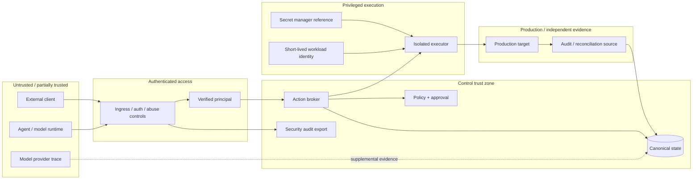

# Threat model

This threat model defines the primary assets, trust boundaries, attacker capabilities, abuse cases,
and required mitigations for ProdKit Control. v0.8.0 reviews the supported production-profile
control mapping; it does not claim that the surrounding cloud, identity provider, network, or
executor implementation is automatically secure.

## Security objective

ProdKit Control must prevent an untrusted model/client from turning a proposal into an uncontrolled
privileged effect, while preserving enough independently verifiable evidence to detect tampering,
bypass, mismatch, and uncertainty within the supported deployment profile.

## Assets

- production systems and data;
- production credentials, secret references, and workload identity;
- canonical event history and security-event exports;
- lineage identities and relations;
- policy bundles and decisions;
- approvals and approver identity;
- prompts/tool arguments/results where retained;
- build/deployment/artifact identities and provenance;
- evidence bundles and external audit references;
- signing keys, trust roots, and external checkpoints;
- tenant data and authorization boundaries;
- operational configuration, migration state, and retention/legal-hold rules.

## Trust boundaries

## Assumptions

The supported production profile assumes:

- cryptographic primitives behave as expected;
- the deployment can isolate executor credentials from untrusted agent/model code;
- secret material is resolved by a trusted executor/provider boundary rather than embedded in
  control-plane contracts;
- multi-replica deployments provide shared atomic replay/rate state where global semantics are
  required;
- at least one trust/evidence source remains independent enough to detect the failures claimed by
  the profile;
- operators follow documented key, backup, deployment, patching, and incident procedures;
- external providers can fail, lie, omit records, or be compromised, so higher assurance does not
  rely on one provider trace alone.

If every privileged host, database administrator, signing key, audit source, and trust anchor is
compromised together, ProdKit Control cannot provide meaningful independent tamper detection.

## Principal threats and controls

| Threat | Failure | Required controls |
| --- | --- | --- |
| Broker bypass | Agent/human changes production without controlled authorization | No direct production credentials for agents; network/credential restrictions; external reconciliation; unexpected-action alerts |
| Action mutation after approval | Approved action differs from executed action | Deterministic action digest; exact approval binding; target/base-state checks; pre-execution revalidation |
| Self-approval / forged human identity | Model/client invents approver | Verified identity/approval service; role/tenant checks; separation of duties |
| Workload impersonation/replay | Captured assertion or wrong workload obtains executor credentials | Short assertion lifetime; issuer/audience/subject/client binding; `nbf`; one-time nonce; atomic replay claim |
| Compromised executor | Executor expands action or fabricates success | Capability allowlists; isolated workers; least privilege; immutable action input; independent reconciliation |
| Ambiguous partial side effect | Crash/timeout hides whether effect occurred | Durable execution state; idempotency ownership; external operation IDs; uncertain state; reconciliation before retry |
| Idempotency key collision/reuse | Different action reuses key | Bind key to canonical digest + tenant/target; conflict on mismatch |
| Cross-tenant data/action access | Tenant A accesses or affects B | Authoritative tenant derivation; scoped repositories/tasks/artifacts/policy/executors; systematic negative tests |
| Secret/data leakage | Sensitive content escapes through events/logs/artifacts | Opaque secret references; immutable provider version; tenant/purpose/audience binding; redaction; encryption; scoped retention |
| Canonical history replacement | Administrator rewrites ledger and recomputes hashes | Append-only privileges; signed checkpoints; independently retained anchors; integrity verification |
| Policy/approval fail-open | Dependency outage causes uncontrolled allow | Fail closed; explicit unavailable state; no default allow |
| External bypass hidden | Production changes outside ProdKit appear normal | Reconciler coverage; audit ingestion; unexpected-action findings |
| Replay/stale authorization | Old approval executes against new state | Expiry; policy revision binding; target/base-state binding; nonce/idempotency semantics |
| Stale worker after failover | Old worker causes duplicate effect | Durable ownership; leases/fencing; idempotency; target-native idempotency where possible |
| Supply-chain compromise | Malicious dependency/build/release alters control plane | Locked dependencies; dependency audit; exact-SHA CI refs; artifact digest/provenance/signature verification; protected release workflow |
| Key compromise | Signing/workload credentials abused | Short-lived credentials; KMS/HSM where appropriate; rotation/revocation; audit; trust-root migration |
| Telemetry confusion | Sampled traces treated as evidence | Canonical unsampled ledger; clear observability/evidence separation |
| Reconciliation poisoning | External evidence mapped to wrong action/tenant | Source identity validation; canonical mapping; tenant scope; conflicting-evidence state |
| API abuse/DoS | Flooding exhausts control resources | Authentication before expensive work; bounded local limiter; shared ingress limit; bounded queues/backpressure; SLO/alerts |
| Audit sink leakage/loss | Security events expose credentials or disappear | Typed events; credential-key redaction; access-controlled durable sink; export health alerts |

The implementation/evidence-level mapping and residual deployment responsibilities are maintained in
`docs/security/production-hardening.md`.

## Threat: broker bypass

An agent with direct cloud, database, GitHub, Kubernetes, or deployment credentials can perform an
action without the broker. Agents therefore must not receive general-purpose production
credentials; privileged routes are restricted; executor credentials are short-lived/scoped; and
external audit sources are reconciled against canonical authorized actions. Unmatched activity is
a high-severity finding. Without bypass prevention/detection, claims are limited to actions routed
through ProdKit Control.

## Threat: mutation after approval

Approving natural-language intent is insufficient when exact arguments can change later. Approval
binds to the canonical action digest, policy revision, target/environment, and relevant pre-state.
Any material mutation requires a new authorization path.

## Threat: compromised executor

An executor is privileged and should be treated as compromiseable. Use narrow capabilities,
isolated worker runtime, immutable authorized action payloads, short-lived scoped credentials,
target-side preconditions/idempotency, before/after observation, independent reconciliation, and no
executor authority to rewrite approvals/policy decisions.

## Threat: uncertain side effects

Timeouts and crashes are security/reliability concerns because unsafe retry can duplicate destructive
operations. The system retains the idempotency claim and moves to `uncertain` when the effect cannot
be proven. Recovery queries target/audit state before retry or compensation.

## Threat: tenant escape

Multi-tenant enforcement covers API routing, repository predicates, object-store keys/deduplication,
caches, background jobs/workflows, policy/approval selection, executor credential mapping,
reconciler external-ID mapping, and administrative support tooling. The enterprise multi-tenant
profile requires systematic cross-tenant negative testing and independent review.

## Threat: canonical history tampering

A SHA-256 event chain is tamper-evident only relative to a trusted anchor. Production assurance
therefore layers append-only database privileges, deterministic chain verification, periodic signed
checkpoints/archive digests, retention-locked or independently controlled anchor storage, and
external evidence reconciliation.

## Threat: evidence/source compromise

No external evidence source is assumed perfect. The reconciliation model preserves source identity,
freshness, and conflict/unverifiable states. Higher assurance can require corroboration across
independent sources for selected effects.

## Threat: supply chain

The control plane itself is security-sensitive. Production release controls include locked
dependencies and dependency audit, protected CI/release execution, exact commit-SHA references for
external Actions/reusable workflows, immutable release tags, artifact digest verification,
SBOM/provenance/signing, and no secret exposure to untrusted fork workflows/self-hosted runners.
Production deployment resolves the human-readable release tag to the verified immutable image
digest.

## Threat: denial of service and overload

Attackers or runaway agents may flood proposals, approvals, execution requests, or expensive
reconciliation. Controls include authentication/authorization before expensive work, rate/size
limits, bounded queues, per-tenant/risk concurrency controls, backpressure, approval deduplication,
circuit breakers/backoff, and resource/cost observability. Failing closed under overload is
preferable to bypassing required authorization.

## v0.8.0 adversarial review matrix

The v0.8 release gate explicitly covers these classes:

- workload assertion replay, including concurrent claim races;
- wrong identity issuer/audience/subject/client and invalid lifetime/activation;
- API bursts exceeding the configured abuse ceiling;
- secret-reference provider/version/tenant/purpose/audience mismatch;
- credential-like fields presented to the security audit exporter;
- provenance with an unverified signature, wrong subject digest, untrusted builder, or disallowed
  build type;
- existing approval mutation/idempotency/tenant/HA/crash tests from earlier milestones;
- deterministic incident exercise for replay, abuse, and supply-chain rejection.

The Security gate additionally enforces dependency audit, exact-SHA workflow/action references,
lockfile presence, and the Kubernetes hardening baseline.

## Residual risk

Even after mitigation, residual risks include undiscovered vulnerabilities in privileged executors,
compromised external identity/policy/audit providers, insider collusion across trust domains,
incomplete external reconciliation coverage, semantic mistakes in expected-effect definitions,
supply-chain compromise before detection, globally inconsistent replay/rate controls when an
operator incorrectly uses the in-memory adapters across replicas, and organizational/physical
compromise beyond deployment assumptions.

## Review status

v0.8.0 closes the roadmap's **supported production-profile security/operational hardening** review
when its exact-head CI, Security, and CodeQL gates pass and no known open Critical finding remains.
This is not the later v1.0 enterprise-assurance claim; the roadmap still requires independent
security review, soak/scale evidence, compatibility/deprecation closure, and documented enterprise
operations before 1.0.
