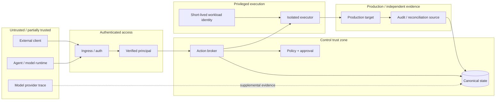

# Threat model

This threat model defines the primary assets, trust boundaries, attacker capabilities, abuse cases, and required mitigations for ProdKit Control. It is an architectural baseline, not a claim that every mitigation is already implemented in `v0.0.1`.

## Security objective

ProdKit Control must prevent an untrusted model/client from turning a proposal into an uncontrolled privileged effect, while preserving enough independently verifiable evidence to detect tampering, bypass, mismatch, and uncertainty within the supported deployment profile.

## Assets

- production systems and data;
- production credentials and workload identity;
- canonical event history;
- lineage identities and relations;
- policy bundles and decisions;
- approvals and approver identity;
- prompts/tool arguments/results where retained;
- build/deployment/artifact identities;
- evidence bundles and external audit references;
- signing keys, trust roots, and external checkpoints;
- tenant data and authorization boundaries;
- operational configuration, migration state, and retention/legal-hold rules.

## Trust boundaries

## Assumptions

The supported production profile assumes:

- cryptographic primitives behave as expected;
- the deployment can isolate executor credentials from untrusted agent/model code;
- at least one trust/evidence source can remain independent enough to detect the failures claimed by the profile;
- operators follow documented key, backup, deployment, and incident procedures;
- external providers can fail, lie, omit records, or be compromised, so higher assurance does not rely on one provider trace alone.

If every privileged host, database administrator, signing key, audit source, and trust anchor is compromised together, ProdKit Control cannot provide meaningful independent tamper detection.

## Principal threats and controls

| Threat | Failure | Required controls |
| --- | --- | --- |
| Broker bypass | Agent/human changes production without controlled authorization | No direct production credentials for agents; network/credential restrictions; external reconciliation; unexpected-action alerts |
| Action mutation after approval | Approved action differs from executed action | Deterministic action digest; exact approval binding; target/base-state checks; pre-execution revalidation |
| Self-approval / forged human identity | Model/client invents approver | Verified identity/approval service; role/tenant checks; separation of duties |
| Compromised executor | Executor expands action or fabricates success | Capability allowlists; isolated workers; least privilege; immutable action input; independent reconciliation |
| Ambiguous partial side effect | Crash/timeout hides whether effect occurred | Durable execution state; idempotency ownership; external operation IDs; uncertain state; reconciliation before retry |
| Idempotency key collision/reuse | Different action reuses key | Bind key to canonical digest + tenant/target; conflict on mismatch |
| Cross-tenant data/action access | Tenant A accesses or affects B | Authoritative tenant derivation; scoped repositories/tasks/artifacts/policy/executors; systematic negative tests |
| Secret/data leakage | Sensitive content escapes through events/logs/artifacts | Secret references; redaction; encryption; scoped retention; telemetry hygiene; access controls |
| Canonical history replacement | Administrator rewrites ledger and recomputes hashes | Append-only privileges; signed checkpoints; independently retained anchors; integrity verification |
| Policy/approval fail-open | Dependency outage causes uncontrolled allow | Fail closed; explicit unavailable state; no default allow |
| External bypass hidden | Production changes outside ProdKit appear normal | Reconciler coverage; audit ingestion; unexpected-action findings |
| Replay/stale authorization | Old approval executes against new state | Expiry; policy revision binding; target/base-state binding; nonce/idempotency semantics |
| Stale worker after failover | Old worker causes duplicate effect | Durable ownership; leases/fencing; idempotency; target-native idempotency where possible |
| Supply-chain compromise | Malicious dependency/build/release alters control plane | Dependency policy; reproducible/verifiable artifacts where possible; signed release/provenance; protected release workflow |
| Key compromise | Signing/workload credentials abused | Short-lived credentials; KMS/HSM where appropriate; rotation/revocation; audit; trust-root migration |
| Telemetry confusion | Sampled traces treated as evidence | Canonical unsampled ledger; clear observability/evidence separation |
| Reconciliation poisoning | External evidence mapped to wrong action/tenant | Source identity validation; canonical mapping; tenant scope; conflicting-evidence state |

## Threat: broker bypass

### Attack

An agent gains direct cloud, database, GitHub, Kubernetes, or deployment credentials and performs an action without the broker.

### Required response

- agents do not receive general-purpose production credentials;
- privileged network routes are restricted where feasible;
- workload credentials are minted/scoped for executor use;
- external audit sources are reconciled against canonical authorized actions;
- unmatched activity becomes a high-severity finding.

Without bypass prevention/detection, claim language must be limited to actions routed through ProdKit Control.

## Threat: mutation after approval

Approving natural-language intent is insufficient when exact arguments can change later. The architecture therefore binds approval to the canonical action digest, policy revision, target/environment, and relevant pre-state.

Any material mutation requires a new authorization path.

## Threat: compromised executor

An executor is privileged and should be treated as compromiseable.

Mitigations include:

- narrow executor capability rather than generic root shells where possible;
- isolated worker runtime;
- immutable authorized action payload;
- short-lived scoped credentials;
- target-side preconditions/idempotency;
- before/after observation;
- independent audit reconciliation;
- no executor authority to rewrite approvals/policy decisions.

## Threat: uncertain side effects

Timeouts and crashes are security/reliability concerns because unsafe retry can duplicate destructive operations.

The system must retain the idempotency claim and move to `uncertain` when the effect cannot be proven. Recovery queries target/audit state before retry or compensation.

## Threat: tenant escape

Multi-tenant security requires enforcement beyond API routing. Attack surfaces include:

- repository methods missing tenant predicates;
- object-store keys/deduplication;
- caches;
- background jobs/workflows;
- policy/approval selection;
- executor credential mapping;
- reconciler external-ID mapping;
- administrative support tooling.

The enterprise multi-tenant profile requires systematic cross-tenant negative testing and independent review.

## Threat: canonical history tampering

A SHA-256 event chain is tamper-evident only relative to a trusted anchor. An administrator who can rewrite all events and the only stored final hash can construct a self-consistent replacement history.

Production assurance therefore layers:

1. append-only database privileges;
2. deterministic chain verification;
3. periodic signed checkpoints/archive digests;
4. retention-locked or independently controlled anchor storage;
5. external evidence reconciliation.

## Threat: evidence/source compromise

No external evidence source should be assumed perfect. A source can be stale, unavailable, compromised, or incomplete.

The reconciliation model should preserve source identity, freshness, and conflict/unverifiable states. Higher assurance can require corroboration across independent sources for selected effects.

## Threat: supply chain

The control plane itself is security-sensitive. Production release controls should include:

- locked dependencies and dependency review/audit;
- protected CI/release execution;
- immutable release tags;
- artifact digest verification;
- SBOM/provenance/signing as roadmap profiles mature;
- review of action dependencies and third-party Actions/workflows;
- no secret exposure to untrusted fork workflows/self-hosted runners.

## Threat: denial of service and overload

Attackers or runaway agents may flood proposals, approvals, execution requests, or expensive reconciliation.

Mitigations include:

- authentication/authorization before expensive work;
- rate/size limits;
- bounded queues;
- per-tenant/risk concurrency controls;
- backpressure;
- approval-request deduplication;
- circuit breakers/backoff for external providers;
- resource/cost observability.

Failing closed under overload is preferable to bypassing required authorization.

## Abuse cases to test

Production hardening should include adversarial scenarios such as:

- mutate one argument after approval;
- reuse approval against another environment;
- reuse idempotency key with changed digest;
- crash worker after target accepts request;
- run two workers against one execution claim;
- call target directly with an agent credential;
- inject another tenant's run/action/artifact ID;
- corrupt/reorder/delete an event;
- replace history while leaving external checkpoint unchanged;
- make policy/approval service unavailable;
- provide stale or conflicting reconciliation evidence;
- cancel the caller while target request is in flight;
- restore from backup with an uncertain action in progress;
- attempt support/admin cross-tenant access without audited elevation.

## Residual risk

Even after mitigation, residual risks include:

- undiscovered vulnerabilities in privileged executors;
- compromised external identity/policy/audit providers;
- insider collusion across multiple trust domains;
- incomplete external reconciliation coverage;
- semantic mistakes in expected-effect definitions;
- dependency/supply-chain compromise before detection;
- physical/organizational compromise beyond the deployment threat assumptions.

These risks should be documented in the supported profile rather than hidden behind absolute security language.

## Review gates

Before the 1.0 enterprise assurance claim, the project roadmap requires:

- threat-model-to-control mapping for the supported deployment profile;
- adversarial bypass/replay/race/crash testing;
- multi-tenant isolation verification when multi-tenancy is supported;
- key/retention/DR operational exercises;
- independent security review;
- resolution of release-blocking critical findings.

`v0.0.1` establishes many canonical mitigations at the contract/reference level but does not claim threat-model closure for the complete production/enterprise profile.
